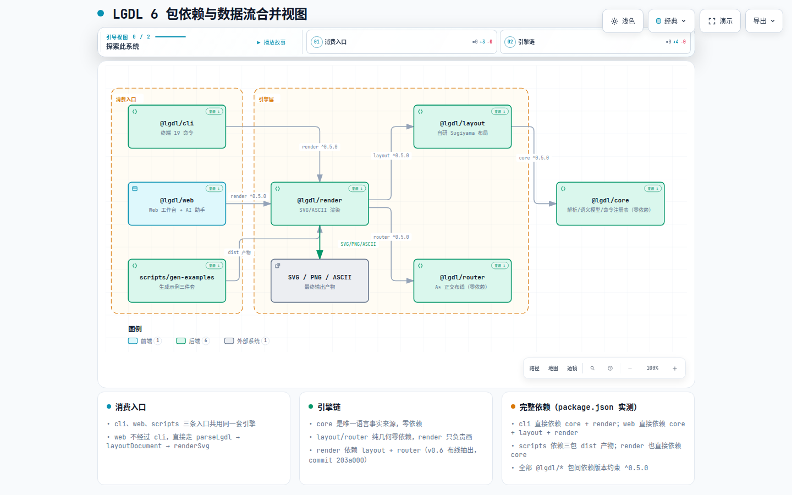

# LGDL 技术全景 — 全景入口

> **文档定位**: sddu-docs-overview — 本级全景入口
> **输出文件名**: docs-overview.md
> **数据来源**: 技术全景 = 代码扫描生成（用户指令触发），未经 SDDU 工作流验证。不包含设计意图、业务语义和技术决策分析以外的推断；业务全景 = Feature 产物聚合（specs-tree-business-panorama discovery 阶段，2026-08-30 增量追加）
> **创建时间**: 2026-08-30
> **版本**: v1.0（基于工作区 `feature/group-as-node` @ `15e5b6b`，2026-08-30）
> **生成方式**: 全量构建（代码级扫描，模式②）+ 增量追加（业务域，模式①）

---

## ⚠️ 扫描口径声明

- 扫描基准为**当前工作区**（分支 `feature/group-as-node`，HEAD `15e5b6b`）。`main` 分支停在 `de2381e`，**不含** v0.6 改动（无 router 包、无 group-as-node）——两者差异已在各文档中标注。
- 测试数字、语法行为、依赖清单均为**当日实测**结果，非文档转述。
- CHANGELOG.md Unreleased 段中**仅采信带验证记录的工程事实**；规划性描述（语义 diff、CI 自动渲染、SSE 等）标注「待审视」，未纳入全景。

---

## 1. 项目概览

| 属性 | 值 |
|------|-----|
| **项目** | LGDL（Logical Graph Description Language） |
| **定位** | 面向 AI Agent 的语义优先图表描述语言：只描述图的逻辑（节点/关系/层级），从不描述布局（坐标/样式）；布局由确定性引擎自动完成 |
| **形态** | npm workspaces monorepo（TypeScript，ESM，Node ≥ 20） |
| **已发布** | v0.5.0（2026-08-23，`@lgdl/cli` 已上 npm，Web 工作台上 GitHub Pages）；v0.6.0 开发中（当前分支） |
| **规模** | 6 包 / 约 1.94 万行 TS 源码 / 11 个内置示例（每种图类型一套 `.lgdl`+`.svg`+`.png` 三件套） |
| **全景覆盖** | What 层：技术全景（系统架构/核心引擎，代码扫描模式②）；Why 层：业务全景（业务全景/，Feature 产物聚合模式①） |

## 2. 子组件（文档树导航）

| 组件 | 类型 | 描述 | 关系说明 |
|------|------|------|---------|
| **系统架构/** | 域目录 | 6 包 monorepo 依赖关系、端到端数据流、router 包职责澄清、部署拓扑 | 全景的「骨架」视图 |
| **核心引擎/** | 域目录 | 四大引擎深潜：core 语义模型、layout 布局、router 布线、render 渲染、web AI 助手 | 全景的「器官」视图，技术含量最高 |
| **业务全景/** | 域目录 | 业务定位（16 条有效 Why）、双层消费模型、核心场景与流程、空白与待确认（含 v0.6 置信度降级） | 全景的「价值」视图（Why 层，聚合自 specs-tree-business-panorama discovery 产物） |
| **adr-index.md** | ADR 索引 | 从 CHANGELOG + git 历史 + 代码证据提炼的 8 条架构决策（决策/备选/理由/证据锚点） | 决策「为什么」视图 |
| **source.md** | 产物溯源 | 本全景聚合的全部原始素材清单（文件 + 实测动作） | 可追溯性 |

## 3. 技术全景（跨域摘要）

### 3.1 技术栈

| 技术 | 版本 | 用途 |
|------|------|------|
| **TypeScript** | ^5.5.0 | 全部 6 包语言（strict 模式，NodeNext / Bundler 双模块策略） |
| **Node.js** | ≥ 20（engines 约束） | 运行时；测试用内置 `node:test` |
| **React + Vite** | 18.3 / 5.4 | 仅 web 包（工作台前端） |
| **CodeMirror 6** | 6.x | 仅 web 包（编辑器：高亮/补全/lint） |
| **openai SDK / @anthropic-ai/sdk** | ^7.5.0 / ^0.120.0 | 仅 web 包（多厂商 AI 接入） |
| **commander** | ^12.0.0 | 仅 cli 包（argv 解析） |
| **核心自研零依赖** | — | core / layout / router 三包零第三方运行时依赖（已实测 package-lock 0 处 dagre/elkjs 残留） |

### 3.2 一图看懂系统（依赖与数据流合并视图）

> **[打开交互图：LGDL 6 包依赖与数据流合并视图](diagrams/architecture-packages.html)**
> 自包含 HTML（Archify 编译，IR 源文件 `diagrams/ir/architecture-packages.json`），支持亮/暗主题切换、平移缩放、聚焦与上下游依赖追踪。

### 3.3 质量基线（2026-08-30 实测）

| 包 | 测试数 | 通过 | 失败 | 说明 |
|----|-------:|-----:|-----:|------|
| core | 281 | 281 | 0 | parser 严格校验 / mutations / operations / commands 四个测试文件 |
| render | 21 | 21 | 0 | svg 渲染 + ascii 渲染 |
| web | 107 | 107 | 0 | locate / snap / ops / provider / web-cli / next-actions / help |
| router | 8 | 8 | 0 | routeEdge 绕障与贴边回归 |
| layout / cli | 0 | — | — | 无独立测试文件（layout 逻辑被 render/core 测试间接覆盖；cli 依赖端到端使用） |

> ⚠️ CHANGELOG.md:15 记载「core 314」，实测 281——差异已记入根级漂移清单。

### 3.4 已知漂移与缺口（仅记录，未修改任何存量文档）

**漂移清单**（存量文档 vs 代码实际）：

| # | 位置 | 文档说法 | 代码实际 |
|---|------|---------|---------|
| D1 | docs/design.md:33 | 默认布局 elkjs，`config.ts` 可切回 dagre | 自研 `layered.ts`；`config.ts` 已删除 |
| D2 | docs/lgdl-spec.md:15,137 | `groups:` 旧语法可用 | 顶层 `groups:` 已被拒绝（实测报 error） |
| D3 | docs/lgdl-spec.md:23-34 | elkjs 层级 + `LAYOUT_ENGINE` 切换 | 自研引擎；config.ts 不存在 |
| D4 | README.md:164-175 | 架构树列 5 包 | 实际 6 包（缺 router） |
| D5 | README.md:177-186 | 「球链网状算法」物理张弛隐喻 | 实现是确定性 Sugiyama 分层，无物理仿真（同节后半段自述 Sugiyama，节内表述自相矛盾） |
| D6 | CHANGELOG.md:21-22 | 「DSL 双语：groups: 与 kind:'group' 均接受」 | 当前代码**拒绝**旧语法——该描述是开发中间态，已过时 |
| D7 | CHANGELOG.md:15,27 | core 314 个测试 | 实测 281 |
| D8 | README.md:57 | 「v0.4.0 核心特性」标题 | 其 §5 内容为 v0.5 特性（Web AI 助手） |

**遗留缺口**：

| # | 缺口 | 影响 |
|---|------|------|
| G1 | `.github/workflows/deploy-pages.yml` 未构建 router 包（paths 触发与 build 步骤均缺失） | main 当前无 router 所以能跑；v0.6 合入后 Pages 构建会失败 |
| G2 | 无 CI 测试工作流（仅本地 `npm test`） | 回归只能靠人肉触发 |
| G3 | README 完全未提 router 包职责 | 新人/Agent 无法从门面文档发现布线引擎 |
| G4 | layout / cli 两包零直接测试 | 布局回归靠 render 测试间接覆盖 |
| G5 | v0.6 规划项（语义 diff、CI 自动渲染、SSE 流式、`lgdl-cli serve` 代理等）在代码中**无实现痕迹**（已 grep 验证） | 属「待审视」规划，不应被当作既成事实引用 |
| G6 | `layoutDocument` 保留 `async` 签名 | elkjs wasm 时代遗留，当前实现全同步 |

---

## 修订记录

| 生成时间 | 变更 Feature | 生成方式 | 修订人 |
|---------|-------------|:--:|--------|
| 2026-08-30 | 代码级扫描全量生成（feature/group-as-node @ 15e5b6b） | 全量构建 | sddu-docs Agent |
| 2026-08-30 | 增量追加业务全景域（specs-tree-business-panorama discovery 产物聚合，HEAD 9855e7e） | 增量追加 | sddu-docs Agent |
