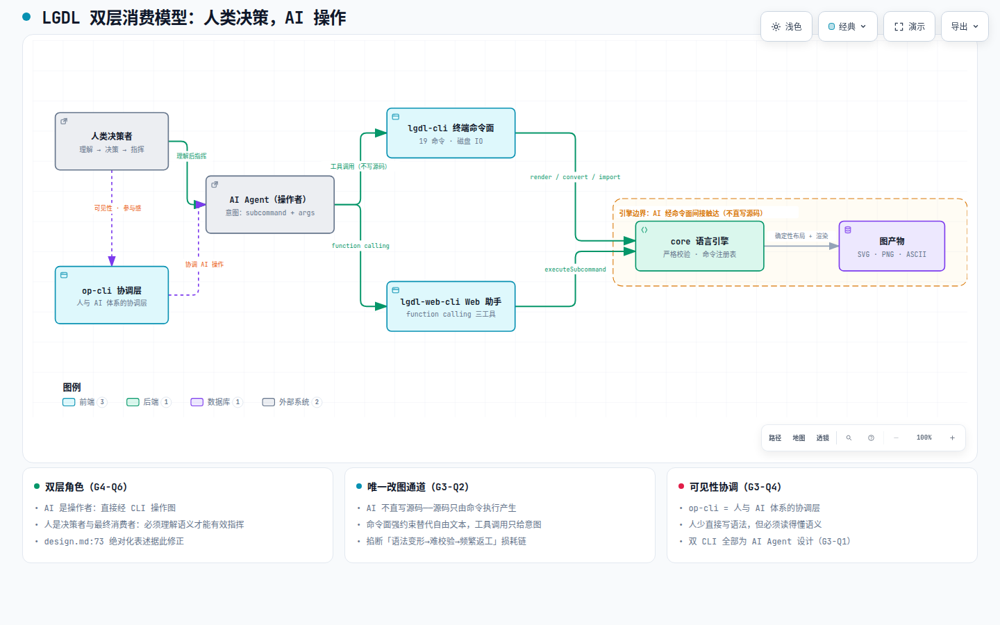

# 业务全景 — 全景入口

> **文档定位**: sddu-docs-overview — 本级全景入口（业务域）
> **输出文件名**: docs-overview.md
> **数据来源**: Feature 产物聚合（`specs-tree-business-panorama` discovery 阶段：discovery.md / facts-baseline.md / handover-spec-brief.md / interview-guide.md），未修改 specs-tree-root 任何内容
> **创建人**: sddu-docs Agent
> **创建时间**: 2026-08-30
> **版本**: v1.0
> **生成方式**: 全量构建（Feature 产物聚合，模式①）

---

## 1. 业务全景

### 1.1 自身概述

| 属性 | 值 |
|------|-----|
| **业务域** | LGDL 业务全景（Why 层） |
| **职责描述** | 回答「LGDL 为什么存在、为谁而做、人与 AI 如何分工」——聚合 discovery 访谈的 16 条有效 Why 结论与 3 项元结论，与技术全景（系统架构/核心引擎，What 层）互补 |
| **输入** | specs-tree-business-panorama discovery 产物（阶段 phase=discovered，2026-08-30 访谈恢复完成） |
| **置信度口径** | 作者确认 / AI 提案待审视 / 用户跳过未获得 三级标注（详见 §5 与《空白与待确认.md》） |
| **版本** | v1.0（feature/group-as-node @ 9855e7e） |

### 1.2 子组件

| 组件 | 类型 | 描述 | 关系说明 |
|------|------|------|---------|
| **核心场景与流程.md** | 业务文档 | 典型用户旅程：人类理解 → 指挥 AI → AI 经 CLI 操作 → 校验反馈 → 验收；四个场景 + 关键机制 | 业务旅程的「怎么走」视图 |
| **空白与待确认.md** | 业务文档 | 10 项跳过空白 + 2 项次要空白 + 收尾两问开放项 + v0.6 置信度降级说明 | 素材的「边界」视图 |
| **diagrams/** | 配图 | 双层消费模型（architecture）+ 核心业务旅程（dataflow），HTML/IR/PNG | 本域概念可视化 |

---

## 2. 核心价值主张（Why 结论聚合）

### 2.1 一句话定位

**LGDL 是一门「语义优先」的图表描述语言：语义交给 AI，布局完全固化给程序——因为现有工具（Mermaid 等）的布局算法在真实业务图上不可预测地差，AI 布局效果不稳定，而 LGDL 从立项第一天起就认定 AI 是绝对核心。**

### 2.2 价值主张的双层叙事：公理先行 + 痛点印证

访谈确认「语义优先」不是事后总结的标签，而是**动手写代码前就立下的设计公理**（G1-Q3 追问②「设计好的」）。痛点观察（AI 布局不稳定、现有算法效果极差）是公理的现实印证，而非公理的来源。全景叙事按「设计公理 + 痛点印证」双层讲，而非纯痛点归纳。

| 层面 | 内容 | 证据 |
|------|------|------|
| **设计公理（先立）** | 语义优先：AI 擅长理解语义、生成逻辑；不擅长（也不应该）计算视觉布局；布局权完全收归程序，语义不变则输出不变 | G1-Q3；design.md:12,29 |
| **痛点印证（后验）** | 现有布局算法在真实业务图上的效果下限**不可预测**（「有时候极差」）→ 输出不可信任；AI 布局效果不稳定 → 需要确定性输出 | G1-Q2；G1-Q3 |
| **烈度校准** | 效率/体验型痛点（「无比煎熬」），非可用性灾难型（「不至于烂到什么程度」）——摩擦烈度足以支撑立项 | G1-Q5 |

### 2.3 五组 Why 结论速览（19 条已作答 = 16 条有效 + 3 条 AI 提案低置信度）

**G1 问题定义与产品定位（4 条）**

| # | 结论 | 出处 |
|---|------|------|
| 1 | 「语义优先」为立项前设计公理，痛点观察是公理的现实印证（非痛点归纳） | G1-Q3 |
| 2 | 痛点本质：现有布局算法效果**不可预测地差**（有时极差）→ 输出不可信任 | G1-Q2 |
| 3 | AI-first 定位从未摇摆，无「给人用、顺带 AI 友好」的折中路线 | G1-Q4 |
| 4 | 痛点烈度 = 效率/体验型（无比煎熬），非可用性灾难型 | G1-Q5 |

**G2 竞争定位（2 条）**

| # | 结论 | 出处 |
|---|------|------|
| 5 | 排除 Mermaid 的理由在语言哲学层：Mermaid 混入颜色等非业务逻辑关注点，语言不「纯逻辑」，改造后也不是 LGDL | G2-Q1 |
| 6 | 兼容/迁移二维框架：对内（兼容）直接抛弃错误设计，不做向后兼容；对外（迁移）由 convert/import CLI 承担成本，语言纯度不拿兼容性做交易 | G2-Q4 |

**G3 目标用户与核心场景（3 条有效 + 2 条低置信度）**

| # | 结论 | 出处 |
|---|------|------|
| 7 | 双 CLI（lgdl-cli / lgdl-web-cli）全部为 AI Agent 设计；人类开发者直接接触 LGDL 语法是少数场景 | G3-Q1 |
| 8 | 「AI 不直写源码」= 用命令面强约束替代自由文本，把「语法变形→难校验→频繁返工」损耗链在源头掐断 | G3-Q2 |
| 9 | op-cli 是人与 AI 体系之间的协调层，「可见性/参与感」是直觉式产品观的具体化 | G3-Q4 |
| 10* | 9 种图类型为 AI 自行规定、无统计依据（低置信度） | G3-Q6 |
| 11* | v0.6「图即代码」等未来需求为 AI 规划、作者标注待审视（低置信度） | G3-Q5 |

**G4 语言设计的产品哲学（3 条有效 + 1 条低置信度）**

| # | 结论 | 出处 |
|---|------|------|
| 12 | 「不留兼容包袱」的底气 = 用户量为零、内部孵化阶段，兼容包袱没有服务对象 | G4-Q1 |
| 13 | error 非 warning：警告意味着规则可选择性遵守（似有似无），会滋生关联性错误；不制造灰色地带 | G4-Q2 |
| 14* | YAML 风格缩进 DSL 为 AI 默认选择、无专项权衡，作者开放更换（低置信度） | G4-Q3 |
| 15 | **双层消费模型**（元结论 ①）：人类理解/决策/指挥 → AI 经 CLI 操作；design.md:73 绝对化表述据此修正（详见 §3） | G4-Q6 |

**G5 版本演进叙事（4 条有效）**

| # | 结论 | 出处 |
|---|------|------|
| 16 | 端排序 Why：先做 Web 难有用户，CLI 是 AI Agent 使用软件的大势所趋，必然优先支持 | G5-Q2 |
| 17 | v0.4 显性化与 v0.5 AI 助手同日完成是**巧合**，非同一条决策链（「铺路」假设被否定） | G5-Q3 |
| 18 | 回望 v0.1：决策集全部成立、无偏差，方向自信度高 | G5-Q7 |
| 19 | v0.6 Why 层素材整体降级（元结论 ③）：作者未审视的 AI 规划仅作 What 层事实引用（详见《空白与待确认.md》§3） | G5-Q5 |

> \* 标注为 AI 提案/规定类结论（低置信度），引用约束见 §5 与《空白与待确认.md》§5。

---

## 3. 双层消费模型（元结论 ①）

### 3.1 模型图示



> **[打开交互图：LGDL 双层消费模型](diagrams/双层消费模型.html)**
> 自包含 HTML（Archify 编译，IR 源文件 `diagrams/ir/双层消费模型.json`），支持亮/暗主题切换、平移缩放、聚焦与路径追踪。

### 3.2 模型说明

访谈对 design.md:73 的绝对化表述（「消费方是 CLI 操作的 AI，不是手写语法的开发者」）做出**重要修正**（G4-Q6）：AI 不会自主使用 LGDL，仍依赖人类决策；人类必须先理解 LGDL，才能指挥 AI 使用。实际消费模型为**双层结构**：

```
人类（理解语义 · 做决策 · 指挥） → AI Agent（执行 · 经 CLI 操作图） → 引擎（校验 · 布局 · 渲染） → 图产物
```

- **AI 是操作者**：直接消费方是 CLI 操作的 AI，但 AI 只给意图（subcommand + args），从不产出文本化的最终源码
- **人是决策者与最终消费者**：人少直接写语法，但**必须读得懂语义**才能有效指挥（与 G3-Q1「开发者直接接触 LGDL 的场景较少」合读）
- **op-cli 是协调层**：人与 AI 体系不应孤立，「看得见、保持参与感」由此落地

**对产品设计的含义**：LGDL 不仅要对 AI 可操作，还要对人类**可理解**——语义可读性成为一等公民。

---

## 4. 目标用户与场景

### 4.1 用户画像（Why 链）

```
AI-first 公理（G1-Q4）→ 双 CLI 全为 AI Agent 设计（G3-Q1）→ 人类开发者直接接触语法为少数场景
```

| 角色 | 接触方式 | 场景 |
|------|---------|------|
| **人类（决策者）** | 阅读语义（必须读得懂）→ 向 AI 下达意图；经 op-cli 观察与参与 AI 操作 | 理解图、验收图、指挥修改 |
| **AI Agent（操作者）** | 经 lgdl-cli / lgdl-web-cli 命令面执行 | 生成图、增量修改图、迁移格式 |

### 4.2 典型业务场景

| 场景 | 通道 | 核心机制 |
|------|------|---------|
| 终端管线：AI 生成/修改图 | lgdl-cli | 命令强约束 + 即时报错（详见《核心场景与流程.md》场景一） |
| Web 工作台：人机协作画图 | lgdl-web-cli（AI 助手） | function calling 三平级工具 + 可见性（场景二） |
| 增量迭代：AI 永不整图重写 | 增量命令 | 每次修改都是增量 patch，源码只由命令执行产生（场景三） |
| 生态迁移：从 Mermaid 迁入 | convert / import | 迁移成本走 CLI 工程通道，不与语言纯度做交易（场景四） |

---

## 5. 人机协作模式与置信度（元结论 ②）

### 5.1 AI 自主决策清单（3 例）

访谈最重要发现之一：LGDL 相当一部分产品决策**实际由 AI Agent 做出**，作者角色是「方向把关 + 验收 + 否决权」。

| # | 决策项 | 证据 | 置信度 |
|---|--------|------|:--:|
| 1 | 9 种图类型的圈定 | 「AI自行规定的，未做严格的统计」（G3-Q6） | 低 |
| 2 | v0.6 路线图 / 未来需求（图即代码等） | 「AI规划出的未来的需求，待审视，不作为参考」（G3-Q5） | 低 |
| 3 | 语法形态 = YAML 风格缩进 DSL | 「没有AI默认选的，如果JSON更好，可以选择更换」（G4-Q3） | 低 |

**规律**：LGDL 的「What 决策」大量由 AI 做出，作者保留方向把关、验收与否决权（可更换）。这个「AI 提案 → 作者审视」协作模式本身就是业务全景「人机协作模式」章节的核心事实。

### 5.2 置信度三级标注规则

| 级别 | 含义 | 引用方式 |
|------|------|---------|
| **作者确认** | 访谈中原话直接确认的决策动机 | 可作为全景叙事依据 |
| **AI 提案待审视** | AI 自主规定/规划，作者未专项论证 | 必须标注「AI 提案 ≠ 作者确认的愿景」，不作愿景叙事 |
| **用户跳过未获得** | 访谈中 ⛔ 跳过的条目 | 如实标注，不编造填充（见《空白与待确认.md》） |

> ⚠️ v0.6 素材另有整体降级规则（元结论 ③），详见《空白与待确认.md》§3。

---

## 6. 技术全景对接

本域是技术全景的「Why 层」补齐。技术细节（What 层）见同级其他域：

| 本域问题 | 对应技术域 |
|---------|-----------|
| 「语义优先 / 确定性布局」在代码里如何落地？ | [系统架构](../系统架构/docs-overview.md)、[核心引擎/core-语义模型](../核心引擎/core-语义模型.md)、[layout-布局引擎](../核心引擎/layout-布局引擎.md) |
| 「AI 不直写源码」的技术兜底（校验门禁）？ | [核心引擎/web-ai助手](../核心引擎/web-ai助手.md)、[端到端数据流-dataflow](../系统架构/端到端数据流-dataflow.md) |
| convert/import 互操作通道？ | [核心引擎/core-语义模型](../核心引擎/core-语义模型.md)（转换注册表） |

---

## 修订记录

| 版本 | 变更说明 | 日期 | 修订人 |
|------|---------|------|--------|
| v1.0 | 业务全景域创建：聚合 specs-tree-business-panorama discovery 产物（16 条有效 Why + 3 项元结论 + 收尾两问开放项） | 2026-08-30 | sddu-docs Agent |
