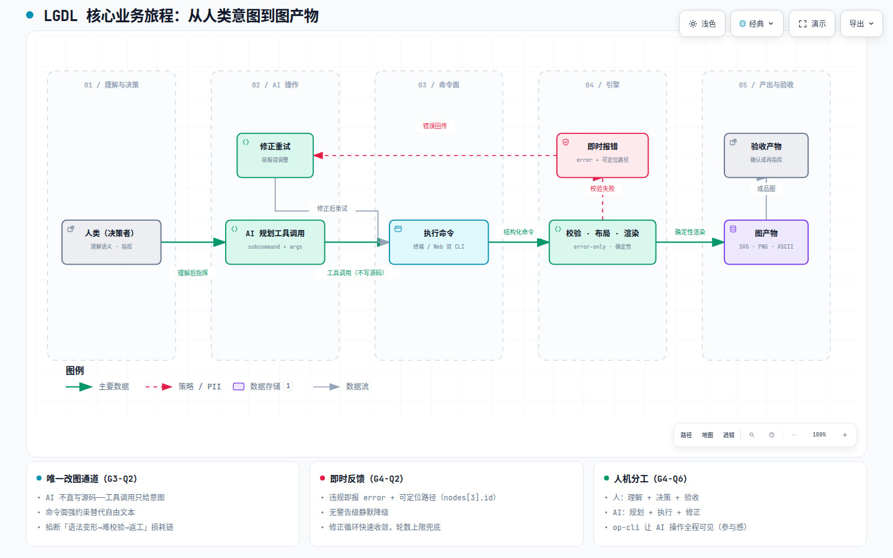

# 业务全景 — 核心场景与流程

> **文档定位**: sddu-docs-scenario — 业务域典型用户场景与工作流（人类理解 → 指挥 AI → AI 经 CLI 操作的业务旅程）
> **输出文件名**: 核心场景与流程.md
> **数据来源**: Feature 产物聚合（specs-tree-business-panorama discovery 阶段：G1/G3/G4 访谈结论 + facts-baseline What 锚点），技术细节交叉引用同级技术域
> **创建人**: sddu-docs Agent
> **创建时间**: 2026-08-30
> **版本**: v1.0
> **更新说明**: 初始创建

---

## 1. 业务旅程总览

### 1.1 旅程图

> **[打开交互图：LGDL 核心业务旅程](diagrams/核心业务旅程.html)**
> 自包含 HTML（Archify 编译，IR 源文件 `diagrams/ir/核心业务旅程.json`），支持亮/暗主题切换、平移缩放、聚焦与路径追踪。

### 1.2 旅程四阶段

| 阶段 | 角色分工 | 关键动作 | Why 依据 |
|------|---------|---------|---------|
| **① 理解与决策** | 人类 | 读懂图语义（节点/关系/层级），形成修改意图 | 双层消费模型：人必须理解才能指挥（G4-Q6） |
| **② 指挥与执行** | 人类 → AI | 向 AI 下达意图；AI 规划工具调用（subcommand + args） | AI 是操作者，只给意图不写源码（G3-Q2） |
| **③ 校验与反馈** | 引擎 → 命令面 → AI | 命令强约束执行；违规即时报错（error + 可定位路径）；AI 解析反馈修正重试 | 错误不可容忍，不制造灰色地带（G4-Q2） |
| **④ 产出与验收** | 引擎 → 人类 | 确定性布局 + 渲染产出图；人类验收或再指挥 | 全量确定性布局，语义不变则输出不变 |

### 1.3 旅程核心不变式

> **源码是唯一事实**：AI 的任何修改都经命令面转成结构化 Operation → 变更 → 校验 → 序列化回源码，LLM 只产生意图，从不产生文本化的最终源码。这是「AI 不直接写源码」铁律（G3-Q2）在旅程中的全程体现。

---

## 2. 场景一：终端管线（lgdl-cli）

**典型会话**：人类在对话中让 AI「画一张订单流转图」，AI 经 lgdl-cli 完成建图与修改。

| 步骤 | 执行者 | 动作 | 机制 |
|------|--------|------|------|
| 1 | 人类 | 描述需求，或要求修改现有 `.lgdl` 文件 | — |
| 2 | AI | 规划命令序列：init → 增量命令 → render | 命令面替代自由文本（G3-Q2） |
| 3 | CLI | 执行 render --file f -o out.svg | 编译管线：parse → layout → render |
| 4 | 引擎 | 校验失败 → 报 error + 可定位路径；成功 → 确定性布局渲染 | error-only 严格校验（G4-Q2） |
| 5 | AI | 按报错修正参数，重试直到 valid | 修正循环（旅程阶段③） |
| 6 | 人类 | 验收 SVG/PNG/ASCII 产物 | — |

**要点**：
- AI 每次修改都是**增量 patch**，永不整图重写（README.md:158）——失败只影响单次操作，不破坏整体。
- 终端场景无人类逐帧观看，靠「即时报错 + 可定位路径」把返工成本压到最低。

---

## 3. 场景二：Web 工作台（lgdl-web-cli AI 助手）

**典型会话**：人类在 Web 工作台与 AI 助手协作画图，全程可见。

| 步骤 | 执行者 | 动作 | 机制 |
|------|--------|------|------|
| 1 | 人类 | 在编辑器写初始语义或直接下达指令 | — |
| 2 | AI 助手 | 原生 function calling 三平级工具：lgdl-web-cli（读写命令）/ lgdl-web-op-cli（观察操作）/ lgdl-web-fetch（取上下文） | v0.5 从 markdown 协议块升级为 function calling |
| 3 | 引擎 | 命令产物须过 validate 门禁，否则整体拒绝 | 「AI 不直写源码」的技术兜底 |
| 4 | 工作台 | 写回编辑器 → 即刻重编译 → 预览更新 | 增量命令闭环 |
| 5 | 人类 | 经 op-cli「看得见、保持参与感」：观察 AI 每一步操作，随时介入 | 协调层（G3-Q4） |

**要点**：
- **可见性即信任**：op-cli 存在的意义是「人与 AI Agent 体系不应该是孤立的」——这是访谈确认的直觉式产品观（G3-Q4），不是功能堆砌。
- 失败反馈修正：任一工具调用失败即标记 failed，所有结果回传后追加一条修正提示，AI 据此调整（对应技术全景 Web AI 命令管线）。

---

## 4. 场景三：增量编辑循环（AI 永不整图重写）

**业务动机**：AI 直写源码的坏结果链 = 自由文本语法无强约束 → 源码易变形 → 变形难校验 → 因语法问题频繁返工。增量命令循环在源头掐断这条链（G3-Q2）。

| 循环环节 | 机制 | 防的是什么 |
|---------|------|-----------|
| 工具调用 → 结构化 Operation | 命令面强约束，参数收敛 | AI 写出语法变形的自由文本 |
| 变更 → 校验门禁 | 写命令产物必须重新通过 validate | 非法中间态进入源码 |
| 序列化回源码 | 源码永远由序列化器写出 | 文本拼接导致的不可解析状态 |
| 报错 → 修正 → 重试 | error + 可定位路径，快速收敛 | 因语法问题的长尾返工 |

---

## 5. 场景四：生态迁移与互操作（convert / import）

**业务动机**：排除 Mermaid 的语言纯度理由（G2-Q1）与「AI 语料里全是 Mermaid 语法」的现实（G2-Q4 追问）之间存在迁移成本矛盾。解法是**二维拆解**：

| 维度 | 原则 | 落地 |
|------|------|------|
| 对内（兼容） | 旧写法若属内部错误的逻辑/设计，直接抛弃，不做向后兼容 | v0.4 两条「破坏性：旧写法不再兼容」变更（用户量为零，无伤害，G4-Q1） |
| 对外（迁移） | 外部用户迁入成本由 CLI 工程通道承担 | `convert --as mermaid/plantuml/json` + `import --from mermaid` |

**含义**：语言纯度（语义/呈现解耦、零灰色地带）不拿兼容性做交易；迁移成本走独立工程通道，两条线互不纠缠。

---

## 6. 关键机制清单

| 机制 | 业务角色 | 证据锚点 |
|------|---------|---------|
| **命令面强约束** | 掐断「语法变形→难校验→返工」损耗链 | G3-Q2；README.md:90 |
| **error-only 严格校验** | 错误不可容忍，规则强制执行，无静默降级 | G4-Q2；README.md:72 |
| **全量确定性布局** | 语义不变则输出不变，AI 无需调坐标 | design.md:29 |
| **增量 patch 协议** | AI 永不整图重写，失败影响局部 | README.md:158 |
| **op-cli 协调层** | 让人类看得见 AI 操作、保持参与感 | G3-Q4；docs/v0.5-web-ai.md:16 |
| **validate 门禁** | 「AI 不直写源码」的技术兜底，写命令产物必须过校验 | 技术全景：Web AI 命令管线 |

---

## 修订记录

| 版本 | 变更说明 | 日期 | 修订人 |
|------|---------|------|--------|
| v1.0 | 初始创建：业务旅程四阶段 + 四场景 + 关键机制清单 | 2026-08-30 | sddu-docs Agent |
