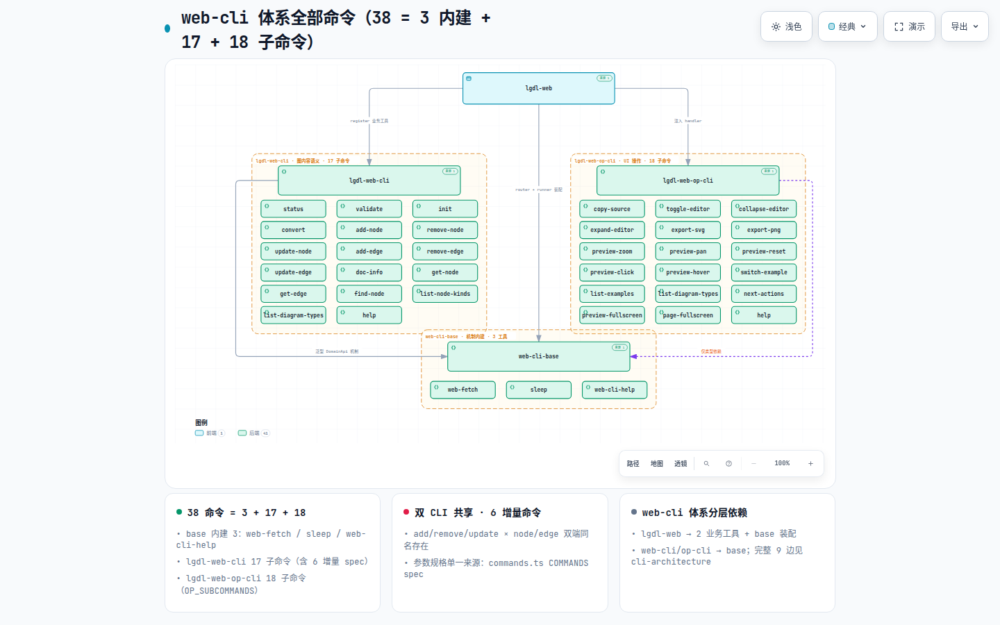
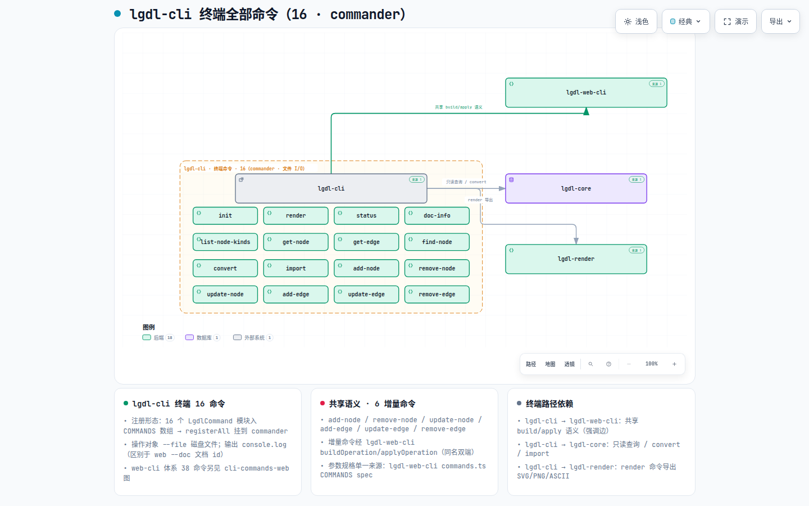
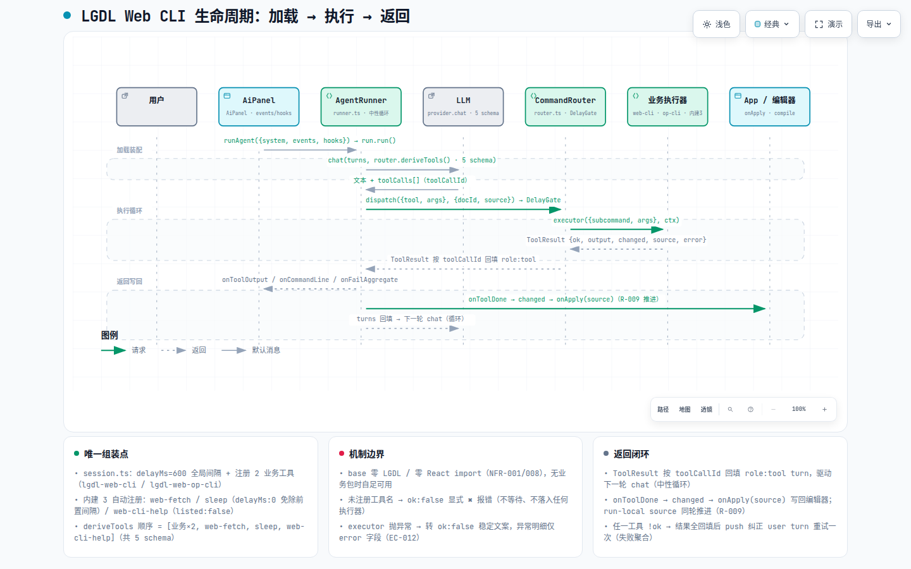

# CLI 架构全景（代码级）— 双 CLI 体系：web-cli 体系 + 原生 lgdl-cli

> **文档定位**: sddu-docs 代码级全景 — **CLI 架构体系全景**（范围声明：仅覆盖 CLI 涉及的 7 包与执行流程；LGDL 系统级全景见同级 [docs-overview.md](docs-overview.md) / [包依赖关系-deps.md](包依赖关系-deps.md)，本文件不展开）
> **输出文件名**: CLI-架构全景-cli-panorama.md
> **数据来源**: ⚠️ **代码扫描生成（用户指令触发）**，未经 SDDU 工作流验证。全部结论带 `文件:行号` 证据。
> **扫描基准**: 分支 `feature/group-as-node`，HEAD `a35b750`（refactor(web-cli-base): CommandRouter 路由下沉 + AgentRunner 上收 + 全局 delay + 注册收敛，2026-09-05；其后 c7d2bd8 为 SDDU 文档提交，不含业务代码）+ 工作区包现状
> **生成时间**: 2026-09-05
> **版本**: v3.2（§3 嵌入两张 CLI 命令全景图——web-cli 体系全部命令 38 + lgdl-cli 终端命令 16，共 54 命令无遗漏，配套 HTML 交互图 + IR + 图注；v3.1 曾补每包完整 CLI 清单逐项命令/工具/子命令表，原 §3~§5 顺延为 §4~§6）
> **数字口径（代码实测）**: op-cli **18 条** OP_COMMANDS / **18 项** enum；App 注册 **19 个** handler；lgdl-web-cli **6** 增量命令 spec + **17** 子命令；base 内建 3 工具 → LLM 可见 **5 工具**；lgdl-cli **16** 命令；provider `buildTools` 与 `lgdl-web/src/ai/lgdl-web.ts` 已于 a35b750 删除；**每包逐项 CLI 清单见 §3**

---

## 1. CLI 体系总览

**一句话结论**：CLI 体系 = **web-cli 体系**（AI 浏览器工作台）与**原生 lgdl-cli**（终端）双体系，共涉 **7 包**；两端**共享 `lgdl-web-cli` 的命令语义层**（COMMANDS 参数规格 + buildOperation + applyOperation），各做各的输入/输出适配——这是当前架构收敛度最高的地方。

> **[打开交互图：CLI 体系架构（双 CLI）](../diagrams/cli-architecture.html)**
> 自包含 HTML（Archify 编译，IR 源文件 `diagrams/ir/cli-architecture.json`），支持亮/暗主题切换、平移缩放、聚焦与上下游依赖追踪。图为 **CLI 专属架构**：7 包 × 三 region（web-cli 体系 / 原生 CLI / 共享底座）× 9 条单向依赖；3 张卡声明核心结论——**双 CLI 共享语义** / **web-cli 唯一组装点** / **范围边界**（lgdl-layout·lgdl-router 属 LGDL 渲染管线，不进 CLI 架构）。

| 包 | CLI 体系角色（一句话） |
|----|----------------------|
| `lgdl-web` | web-cli 体系**应用入口 / 唯一组装点**：session.ts 组装 CommandRouter + 注册 2 业务工具，App 注入 19 个 op handler |
| `lgdl-web-cli` | 图内容操作语义——**双 CLI 共享中枢**：6 增量命令 spec + buildOperation/applyOperation + 17 子命令协议 |
| `lgdl-web-op-cli` | UI 操作语义（**仅 web-cli 体系**）：OP_COMMANDS 18 条单一数据源 + OpHandlerRegistry 注入面 |
| `web-cli-base` | **纯机制框架层**（零 LGDL / 零 React）：CommandRouter / AgentRunner / DelayGate / 3 内建工具 |
| `lgdl-cli` | **原生终端 CLI**：commander 外壳 + 16 命令模块 + 文件 I/O，独立于 web-cli 体系的路由/循环 |
| `lgdl-core` | 语义底座（parse/validate/mutation）——CLI 体系读写最终落点 |
| `lgdl-render` | 渲染导出（SVG/PNG/ASCII）——lgdl-cli `render` 命令后端（亦被 lgdl-web 消费） |

**双体系执行路径**：原生 `lgdl-cli → lgdl-web-cli → lgdl-core`（+ lgdl-render 导出）；web `lgdl-web → lgdl-web-cli / lgdl-web-op-cli → web-cli-base → lgdl-core`（语义层之下）。

> **范围边界**：lgdl-layout / lgdl-router 属 LGDL 渲染管线（App 实时渲染），**不进任何 CLI 执行路径**（lgdl-cli 依赖清单实测无此二包），本文件不覆盖，详见 [docs-overview.md](docs-overview.md)。

---

## 2. 每包 CLI 角色 / 边界 / 能力

| 包 | CLI 角色 | 边界 | 提供给 CLI 的能力（证据） |
|----|---------|------|--------------------------|
| **web-cli-base** | web-cli 体系路由+循环+执行骨架 | 机制层零 LGDL（index.ts:1-14「mechanism only」；零 react）；运行时依赖仅 openai/anthropic SDK | CommandRouter 单一数据源：register 重名抛错/dispatch（delay gate 前置）/deriveTools/deriveCommand（router.ts:39-56,182-205,259-272）；内建自动注册 web-fetch+sleep(delayMs:0 免间隔)+web-cli-help(listed:false) :124-177；AgentRunner 中性 AI 循环（runner.ts:30-47,121-196）；DelayGate 命令间最小间隔（delay.ts:57-92）；createExecutor 19 符号注入面 exec.ts:58-83 + 文本批量 executeCommands :315-373；llm.ts 双 SDK 中性客户端 :72-254 |
| **lgdl-web-cli** | 双 CLI 体系**共享语义中枢**（图内容操作） | 依赖 base（泛型机制）+ lgdl-core（类型）单向无环；不依赖 React/lgdl-web——纯 Node 可测 | 整体注册 **1 个 ToolEntry**（tool-entry.ts:21-43，FR-018）；adapters/lgdl.ts 组装单点：lgdlKindResolver + createOperationApplier(lgdlDispatch) + lgdlBuildOperation + **19 符号 lgdlDomain** + lgdlExecutor 单例 :46-111；COMMANDS **6 增量命令 spec**（commands.ts:22-65）；lgdlDispatch 6 变体（operations.ts:83 起）；17 子命令协议 + --doc 一致性（protocol.ts:30-126） |
| **lgdl-web-op-cli** | UI 操作语义（OP_COMMANDS + handler 注入） | 包内**零 UI 实现/零 React**（handlers.ts:4-6）；next-actions 运行时被 AiPanel intercept 拦截，App 仅防御兜底 | OP_COMMANDS **18 条**单一数据源（ops.ts:11-75）→ OP_SUBCOMMANDS 18 项 enum（:87-90）→ WEB_OP_TOOL（tool.ts:11-55）；ToolEntry 转发 registry.execute（tool-entry.ts:22-34）；OpHandlerRegistry 注入面（handlers.ts:19-38） |
| **lgdl-web** | web-cli 体系入口 / 组装点 | 跑在浏览器（React）；UI 副作用全部经注入 handler 完成 | session.ts **唯一 CommandRouter 组装点**：createCommandRouter({delayMs:600}) + register 2 业务工具 + runAgent 装配（:54-91）；AiPanel runAgent 触发 + intercept/onToolDone hooks（:353-407）；provider 8 厂商接入（`buildTools` 已删，schema 派生 = router.deriveTools() :14-15,240-256）；App **19 个 op handler** 注入 + applyAiSource 编辑器写回（:992-1125,917-921） |
| **lgdl-cli** | 原生终端 CLI（commander + 文件 I/O） | 无 CommandRouter/AgentRunner/DelayGate——不经过 web-cli-base；操作对象 `--file 磁盘` vs web `--doc 文档 id`；输出 console.log vs ToolResult | 可插拔命令注册表 + COMMANDS **16 命令**（registry.ts:11-20,35-52）；增量命令调 lgdl-web-cli buildOperation/applyOperation（add-node.ts:4,32-41）；只读查询/render/convert 调 lgdl-core / lgdl-render（queries.ts:4,9；render.ts:7；convert.ts:6） |
| **lgdl-core** | CLI 的语义来源 | 零依赖，被两端 read/mutation 最终落点 | parseLgdl/validate/serialize/addNode… 单一实现；web-cli-base 经 DomainApi 泛型刻意隔离（exec.ts:58-83） |
| **lgdl-render** | lgdl-cli `render` 命令导出后端 | 亦被 lgdl-web 渲染消费（App.tsx:13） | renderSvg/renderAscii 供终端导出 SVG/PNG/ASCII |

---

## 3. 每包 CLI 清单（命令 / 工具 / 子命令全量）

> **清单口径**: 以下清单全部以**代码枚举/注册表**为准逐项抄录（COMMANDS 数组 / OP_COMMANDS 注册表 / 工具 schema enum / 协议分支 switch），非凭记忆概括。数量与 §1 头部数字口径一致：base **3** 内建 → LLM 可见 **5** 工具（+2 业务）；lgdl-web-cli **1** 工具 = **17** 子命令（含 **6** 增量命令 spec）；lgdl-web-op-cli **1** 工具 = **18** 子命令（OP_SUBCOMMANDS enum）；lgdl-cli **16** 命令。

**命令全景图**（Archify 编译交付，visual-check exit 0；单张 54 节点全量图因 1440px 宽度可读性下限/纵向溢出无法通过，按方案拆为两张，54 命令无遗漏）：

> **[打开交互图：web-cli 体系全部命令](../diagrams/cli-commands-web.html)**
> 自包含 HTML（Archify 编译，IR 源文件 `diagrams/ir/cli-commands-web.json`），支持亮/暗主题切换、平移缩放、聚焦与上下游依赖追踪。图为 **web-cli 体系全部命令**：38 命令 = base 3 内建（web-fetch / sleep / web-cli-help）+ lgdl-web-cli 17 子命令 + lgdl-web-op-cli 18 子命令，3 region（web-cli 体系 / 原生 CLI / 共享底座）。

> **[打开交互图：lgdl-cli 终端命令](../diagrams/cli-commands-cli.html)**
> 自包含 HTML（Archify 编译，IR 源文件 `diagrams/ir/cli-commands-cli.json`），支持亮/暗主题切换、平移缩放、聚焦与上下游依赖追踪。图为 **lgdl-cli 终端命令**：16 命令 + 共享语义节点。

> **图注**: 两张图合计 **54 命令 = web 体系 38（base 3 内建 + lgdl-web-cli 17 + lgdl-web-op-cli 18）+ lgdl-cli 16**，无遗漏、无重叠；**包间 9 边依赖交叉引用 §1 `cli-architecture` 图**，命令节点间不画边。

| 包 | 提供的 CLI（命令/工具/子命令） | 数量 | 来源证据（文件:行号） |
|----|------------------------------|------|----------------------|
| **web-cli-base** | 内建工具 `web-fetch` / `sleep` / `web-cli-help`（CommandRouter 构造即自动注册） | 3 工具 | router.ts:89 BUILTIN_ORDER、:124-135 构造注册、:137-177 buildBuiltinEntry；tools.ts:12-107 schema |
| **lgdl-web-cli** | 业务工具 `lgdl-web-cli` = 17 子命令（tools.ts enum）；其中 6 条为共享增量命令 spec（COMMANDS） | 1 工具 / 17 子命令 | tools.ts:33-41；commands.ts:22-65；protocol.ts:78-126 |
| **lgdl-web-op-cli** | 业务工具 `lgdl-web-op-cli` = 18 子命令（OP_SUBCOMMANDS enum；OP_COMMANDS 18 条含 `export` 别名） | 1 工具 / 18 子命令 | ops.ts:11-75、:87-90；tool.ts:37-40 |
| **lgdl-cli** | 终端命令 16 条（COMMANDS 数组，commander 注册） | 16 命令 | registry.ts:35-52 |
| **lgdl-core** | 被 CLI 消费的库入口：parse/validate/serialize/mutation/query/convert/template | 7 组（>30 符号） | index.ts:4-40 |
| **lgdl-render** | 被 lgdl-cli `render` 消费的导出入口 | 2 入口 | index.ts:369、:1278（← ascii.ts:165） |

### 3.1 web-cli-base — 3 内建工具（零 LGDL 中性平台工具）

> 注册形态：`CommandRouter` 构造即自动注册（router.ts:124-135），工具 schema 见 tools.ts。三工具为平台级能力，不属任何业务 CLI；`sleep` 条目声明 `delayMs:0` 免除前置间隔（router.ts:156，ADR-003/FR-016），`web-cli-help` 条目 `listed:false` 不自列（router.ts:169，EC-010）。

| # | 工具名 | 一句话用途 | 参数要点（fc args / 文本 --key） | 证据 |
|---|--------|-----------|-------------------------------|------|
| 1 | `web-fetch` | 抓取 web 资源（同源相对路径或完整 URL）并返回原文 | `--path`（args.path）**必填，无默认值**：URL 或同源相对路径，如 `guide.md` / `https://example.com/doc.md`；省略报 "missing --path" | tools.ts:12-48（WEB_FETCH_TOOL）；router.ts:139-149（executor → executeWebFetch） |
| 2 | `sleep` | 通用时序等待（与任何 CLI 无关的中性平台工具） | `--ms <毫秒>` 或 `--seconds <秒>` **二选一必填**（省略报错）；如 `sleep --ms 5000`；clamp 上限 600000ms | tools.ts:51-78（SLEEP_TOOL）；sleep.ts:79-95（normalizeSleepArgs）；router.ts:150-162（delayMs:0） |
| 3 | `web-cli-help` | 顶层工具发现：无参列出全部可用工具，`--tool <name>` 查单工具详情 | `--tool`（args.tool）可选：缺省 = 列全部；给 tool 名 = 该工具子命令/详情 | tools.ts:81-107（WEB_CLI_HELP_TOOL）；router.ts:163-177（listed:false） |

### 3.2 lgdl-web-cli — 1 工具 × 17 子命令（双 CLI 共享语义中枢）

> 工具 schema `WEB_CLI_TOOL`（tools.ts:9-51，name=`lgdl-web-cli`）。子命令 enum 在 tools.ts:33-41，与 protocol.ts:78-126 协议 switch **逐项一致**（enum 17 项 ↔ switch 分支 17 类；其中 help 无协议分支、由执行器 help 优先兜底）。全部 17 个子命令：

| # | 子命令 | 类别 | 参数要点 | 证据 |
|---|--------|------|---------|------|
| 1 | `status` | 只读/文档级 | 无参（--doc 由场景注入） | enum tools.ts:34；protocol.ts:78-79 |
| 2 | `validate` | 只读/文档级 | 无参 | enum tools.ts:34；protocol.ts:80-81 |
| 3 | `init` | 文档级 | `--type <diagramType>` | enum tools.ts:34；protocol.ts:82-85 |
| 4 | `convert` | 文档级 | `--to <format>` 必填（mermaid/plantuml/json） | enum tools.ts:34；protocol.ts:86-93 |
| 5 | `add-node` | 增量命令 spec #1 | `--id` 必填；`--label` / `--kind` / `--group` / `--member` / `--contains`（kind=group 建组）/ `--attrs` | commands.ts:23-29；protocol.ts:94-97 |
| 6 | `remove-node` | 增量命令 spec #2 | `--id` 必填（自动清理挂接边） | commands.ts:30-36；protocol.ts:98-101 |
| 7 | `update-node` | 增量命令 spec #3 | `--id` 必填；变更参数至少一：`--new-id` / `--label` / `--kind` / `--member-add` / `--member-remove` / `--contains-add` / `--contains-remove` / `--attrs` | commands.ts:37-43；protocol.ts:102-105 |
| 8 | `add-edge` | 增量命令 spec #4 | `--from` + `--to` 必填；`--label` / `--cardinality-from` / `--cardinality-to` / `--attrs` | commands.ts:44-50；protocol.ts:106-109 |
| 9 | `remove-edge` | 增量命令 spec #5 | `--from` + `--to` 必填；`--edge-label` / `--label`（多平行边定位） | commands.ts:51-57；protocol.ts:110-113 |
| 10 | `update-edge` | 增量命令 spec #6 | `--from` + `--to` 必填；变更参数至少一：`--edge-label` / `--new-from` / `--new-to` / `--label` / `--cardinality-from` / `--cardinality-to` / `--attrs` | commands.ts:58-64；protocol.ts:114-117 |
| 11 | `doc-info` | 只读查询 | `--doc` 隐含当前文档 | protocol.ts:121-127 |
| 12 | `get-node` | 只读查询 | `--id` | protocol.ts:121-127 |
| 13 | `get-edge` | 只读查询 | `--from` / `--to` / `--label` | protocol.ts:121-127 |
| 14 | `find-node` | 只读查询 | `--label` / `--q` | protocol.ts:121-127 |
| 15 | `list-node-kinds` | 只读查询 | 无参 | protocol.ts:121-127 |
| 16 | `list-diagram-types` | 只读查询 | 无参 | protocol.ts:121-127 |
| 17 | `help` | 帮助 | `--topic <cmd>` 查单命令用法；无参 = 顶层一览 | tools.ts:26-27（description 声明）；exec.ts help 优先 |

### 3.3 lgdl-web-op-cli — 1 工具 × 18 子命令（UI 操作，仅 web-cli 体系）

> 注册形态：`OP_COMMANDS` 18 条单一数据源（ops.ts:11-75，含 `export` 别名元数据但**不进 enum**）→ `OP_SUBCOMMANDS` enum **18 项**（ops.ts:87-90 = 17 条非别名命令 + `help`）→ `WEB_OP_TOOL` schema（tool.ts:37-40 enum 派生）。逐项：

| # | 子命令 | 一句话用途 | 参数要点 | 证据（ops.ts） |
|---|--------|-----------|---------|---------------|
| 1 | `copy-source` | 复制当前图源码到剪贴板 | 无参 | :12 |
| 2 | `toggle-editor` | 切换编辑器收缩/展开 | 无参 | :13 |
| 3 | `collapse-editor` | 收缩编辑器 | 无参 | :14 |
| 4 | `expand-editor` | 展开编辑器 | 无参 | :15 |
| 5 | `export-svg` | 导出当前图为 SVG 文件 | 无参 | :16 |
| 6 | `export-png` | 导出当前图为 PNG 文件 | 无参 | :17 |
| — | ~~`export`~~ | ⚠️ 别名：`--format svg\|png`（元数据存在，**不暴露给模型**，不入 enum） | `--format`（svg 默认 / png） | :18-23 |
| 7 | `preview-zoom` | 缩放预览：倍率或方向+增量 | `--factor`，或 `--direction`(1/in 放大,-1/out 缩小) + `--delta`(默认 200,范围 50-800)；`--anchorX` / `--anchorY` | :24-34 |
| 8 | `preview-pan` | 平移预览 | `--dx` / `--dy` | :35-42 |
| 9 | `preview-reset` | 重置预览为整图适配 | 无参 | :43 |
| 10 | `preview-click` | 预览中点击定位元素（编辑器同步跳转） | `--loc` 必填（如 `nodes[3]` / `edges[1]` / `groups[0]`） | :44-48 |
| 11 | `preview-hover` | 预览中悬浮元素（高亮+锚点；`--loc none` 取消） | `--loc` 必填 | :49-53 |
| 12 | `switch-example` | 切换工作台示例图 | `--id` 必填（list-examples 可查） | :54-58 |
| 13 | `list-examples` | 列出全部示例图（id/标签/类型/规模） | 无参 | :59 |
| 14 | `list-diagram-types` | 列出全部图类型 | 无参 | :60 |
| 15 | `next-actions` | 推荐下一步动作（聊天框可点击胶囊卡片，不改图） | `--actions` 必填 = JSON 数组字符串 `[{"label","prompt"}]`（2-4 个） | :61-72 |
| 16 | `preview-fullscreen` | 预览沉浸模式 | `--state on` 进入 / `off` 退出 / 无参 toggle | :73 |
| 17 | `page-fullscreen` | 整页浏览器全屏（Fullscreen API） | `--state on` 进入 / `off` 退出 / 无参 toggle | :74 |
| 18 | `help` | 操作级帮助 | `--topic <op>` 查单操作用法；无参 = 全部一览 | :87-90（enum 追加）；tool.ts:30,32 |

### 3.4 lgdl-cli — 16 终端命令（commander 外壳）

> 注册形态：每个命令为独立模块导出 `LgdlCommand`，入 `COMMANDS` 数组（registry.ts:11-20 接口、:23-33 导入、:35-52 数组）→ `registerAll` 逐一挂到 commander program（:55-66）。**注册序 = 下方顺序**。逐项（命令名 + 一句话用途 + 关键参数）：

| # | 命令 | 一句话用途 | 关键参数 | 证据（commands/） |
|---|------|-----------|---------|------------------|
| 1 | `init` | 用类型化骨架初始化 .lgdl 文件（已存在则拒绝） | `--file` 必填；`--type`（默认 flowchart） | init.ts:6-31 |
| 2 | `render` | 渲染图为 SVG（自动布局）或 ASCII | `--file` 必填；`-o/--output`（默认 out.svg）；`--format`（svg 默认 / ascii） | render.ts:9-65（消费 lgdl-layout + lgdl-render） |
| 3 | `status` | 打印文本图结构（AI 可读） | `--file` 必填 | queries.ts:111-125 |
| 4 | `doc-info` | 打印文档概览（type/size/kind 分布） | `--file` 必填 | queries.ts:11-25 |
| 5 | `list-node-kinds` | 列出全部 node kind（AI 可读） | 无参 | queries.ts:27-39 |
| 6 | `get-node` | 打印单节点详情（members/attrs/groups） | `--file` 必填；`--id` 必填 | queries.ts:41-61 |
| 7 | `get-edge` | 打印 from/to 间边（可按 label 过滤） | `--file` 必填；`--from` / `--to` / `--label` | queries.ts:63-85 |
| 8 | `find-node` | 按 label/id 子串搜索节点 | `--file` 必填；`--label` 或 `--q` | queries.ts:87-108 |
| 9 | `convert` | 转换图为其他格式（mermaid/json/plantuml…） | `--file` 必填；`--as <format>` 必填；`-o/--output`（默认 stdout）；含无损性警告 | convert.ts:8-177（消费 lgdl-core convert） |
| 10 | `import` | 从其他格式导入为 LGDL（mermaid/json） | `--file` 必填；`--from`（mermaid/json 必填）；`--output` 必填；`--force` 覆盖 | import.ts:7-92（消费 lgdl-core importMermaid） |
| 11 | `add-node` | 添加节点（kind=group + --contains 建组） | `--file` 必填；`--id` 必填；`--label` / `--kind` / `--group` / `--contains` / `--member` / `--attrs` | add-node.ts:6-45（经 lgdl-web-cli buildOperation） |
| 12 | `remove-node` | 删除节点（自动清理挂接边） | `--file` 必填；`--id` 必填 | remove-node.ts:6-20 |
| 13 | `update-node` | 更新节点 label/kind/members/attrs/组成员 | `--file` 必填；`--id` 必填；`--new-id` / `--label` / `--kind` / `--member-add` / `--member-remove` / `--contains-add` / `--contains-remove` / `--attrs` | update-node.ts:6-41 |
| 14 | `add-edge` | 添加边 | `--file` 必填；`--from` + `--to` 必填；`--label` / `--cardinality-from` / `--cardinality-to` / `--attrs` | add-edge.ts:6-35 |
| 15 | `update-edge` | 更新边 label/attrs/端点 | `--file` 必填；`--from` + `--to` 必填；`--edge-label` / `--new-from` / `--new-to` / `--label` / `--cardinality-from` / `--cardinality-to` / `--attrs` | update-edge.ts:6-41 |
| 16 | `remove-edge` | 删除边 | `--file` 必填；`--from` + `--to` 必填；`--edge-label`（多平行边定位） | remove-edge.ts:6-25 |

### 3.5 lgdl-core / lgdl-render — 被 CLI 消费的入口（简列）

> 二包非 CLI 本身，仅列被 lgdl-cli（终端路径）与 lgdl-web-cli（语义层）消费的公开入口，不逐项展开。

| 包 | 被消费入口（index 导出） | 消费方 | 证据 |
|----|-------------------------|--------|------|
| **lgdl-core** | 解析/校验：`parseLgdl` / `validate`；序列化：`serializeLgdl`；mutation：`addNode` / `addEdge` / `removeNode` / `removeEdge` / `updateNode` / `updateEdge`；查询：`queryStatus` / `listNodeKinds` / `queryDocInfo` / `queryNode` / `queryEdge` / `findNodes`；分组：`groupNodes` / `deriveGroups`；转换：`convert` / `listFormats` / `registerConverter` / `importMermaid` / `exportMermaid`（plantuml/json 经副作用注册）；模板：`initTemplate` / `templateForType` / `supportedTemplateTypes`；状态：`formatStatus` | lgdl-cli 只读/render/convert/import；lgdl-web-cli 经 buildOperation 6 变体 + lgdlDispatch（operations.ts:83 起） | index.ts:4-40；lgdl-cli/commands/*.ts import |
| **lgdl-render** | `renderSvg(doc, layout)` → SVG 字符串；`renderAscii(doc, layout)` → ASCII 字符串（ascii.ts:165，index.ts:1278 re-export） | lgdl-cli `render` 命令（render.ts:7）；lgdl-web App 渲染（App.tsx:13） | index.ts:369、:1278；ascii.ts:165 |

---

## 4. CLI 生命周期（开发 → 注册 → 加载 → 执行 → 返回）

> **[打开交互图：CLI 生命周期](../diagrams/cli-lifecycle.html)**
> 自包含 HTML（Archify 编译，IR 源文件 `diagrams/ir/cli-lifecycle.json`），支持亮/暗主题切换、平移缩放、聚焦与路径追踪。图为 **a35b750 新架构**（含 CommandRouter / AgentRunner / DelayGate / session）：7 参与者（用户/AiPanel/AgentRunner/LLM/CommandRouter/业务执行器/App）× 3 段（加载装配/执行循环/返回写回），3 张卡点明核心结论——**唯一组装点**（session.ts）/ **机制边界**（base 零 LGDL）/ **返回闭环**（changed→source→编辑器写回）。

| 阶段 | 要点（关键代码位置） | 出口/产物 |
|------|---------------------|----------|
| **① 开发**（三套写法） | 终端命令 = `LgdlCommand{name,description,examples,register(program)}` 入 COMMANDS 数组（registry.ts:35-52；add-node.ts:6-44）；AI 工具 = `ToolEntry{schema,prefix,executor,delayMs?,listed?}` → router.register（router.ts:39-56；tool-entry.ts:21-43）；UI 操作 = OP_COMMANDS 元数据 + **App 侧注入 handler**（ops.ts；App.tsx:992-1125）。增量图命令的参数规格与 op 构造/应用**只写一次**于 lgdl-web-cli（commands.ts + operations.ts） | 三种扩展点并存、共享一份业务逻辑 |
| **② 注册** | base 构造即注册 3 内建 `[web-fetch, sleep, web-cli-help]`（router.ts:89,124-177）；session.ts 唯一组装点 register 2 业务工具（:57-58）→ LLM 可见 **5 工具顺序 = [lgdl-web-cli, lgdl-web-op-cli, web-fetch, sleep, web-cli-help]**（deriveTools :194-205）；重名注册抛错（:182-188） | 5 工具 schema 派生完成 |
| **③ 加载**（装配） | createAiSession：router({delayMs:600}) + 业务注册 + runAgent 每指令装配——chat 的 schema = router.deriveTools()（session.ts:73-78，provider buildTools 已删）；dispatch 绑定 router+ctx 并推进 runSource（:82-88）；system/events/hooks 由 AiPanel send() 注入（AiPanel.tsx:353-406）→ run.run() :407 | 单 run 上下文就绪 |
| **④ 执行**（循环） | step: system+chat → 有 toolCalls 则逐条：① deriveCommand→onCommandLine（命令块渲染）② hooks.intercept（op-cli/next-actions→胶囊，**不落 dispatch**，AiPanel.tsx:389-400）③ dispatch：未注册→ok:false（router.ts:262）→ DelayGate 600ms/条目 delayMs（:264-265；sleep 0 免除）→ executor：lgdl-web-cli 走 exec 管线（help 优先→只读→buildOperation→applyOperation→validate→serialize，exec.ts:147-308）/ op-cli 走 registry→App handler / 内建直执（router.ts:139-177）④ onToolOutput→turns 回填 ⑤ onToolDone→changed→onApply 写回（AiPanel.tsx:401-404）。任一 !ok → onFailAggregate 纠正 user turn（runner.ts:179-183）；LLM 错重试 1 次（:108-119）；maxRounds 1000 | ToolResult{ok/output/changed/source/error} |
| **⑤ 返回**（闭环） | ToolResult 按 toolCallId 回填 turns → 成为 LLM 下一轮上下文（runner.ts:177）；onToolOutput 用户可见（AiPanel.tsx:371）；changed → applyAiSource 编辑器写回 + clear compileCache（App.tsx:917-921）；runSource 推进保证同 run 后续工具作用于最新源码（session.ts:85-87，R-009）；无 toolCalls 文本收尾 → completed | 文档态 + 对话态同步 |

---

## 5. 边界分析

### 5.1 CLI 体系内部依赖方向（单向无环）

CLI 体系包间依赖共 **9 条**，方向与无环性见 §1 `cli-architecture` 图全量呈现，文字归纳：

- **web-cli 体系内**：`lgdl-web`（入口）→ `lgdl-web-cli`（register 业务工具）/ `lgdl-web-op-cli`（注入 handler）/ `web-cli-base`（router+runner 装配）；`lgdl-web-cli → web-cli-base`（泛型 DomainApi 机制）、`lgdl-web-cli → lgdl-core`（类型契约）；`lgdl-web-op-cli → web-cli-base` 为**虚线——仅类型依赖**（HelpEntry/ToolEntry/ToolCallArgs）。
- **原生 CLI**：`lgdl-cli → lgdl-web-cli`（共享 build/apply 语义）/ `lgdl-core`（只读查询 / convert）/ `lgdl-render`（render 导出）。
- **跨体系无反边**：lgdl-web 不 import lgdl-cli；lgdl-layout / lgdl-router 不在上图的 CLI 依赖集合中。
- **base 零 LGDL / 零 React 现状核验通过**（见 §2）：llm.ts 直接依赖 openai/anthropic SDK 是 base 唯一第三方运行时面。
- LGDL **系统级 9 包**逐边依赖表见同级 [包依赖关系-deps.md](包依赖关系-deps.md)；本文件仅覆盖 CLI 体系的 7 包 9 边。

### 5.2 三套注册机制并存与收敛现状

| 注册机制 | 存续面 | 顶层路由角色 | 收敛状态 |
|---------|--------|------------|---------|
| `lgdl-cli` COMMANDS（commander） | 终端 16 命令 | 自身 parse→action | **未纳入 CommandRouter**（终端无 AI 循环）；经 lgdl-web-cli 语义共享 |
| `CommandRouter` ToolEntry | web-cli 2 业务 + 3 内建 = **5 工具** | web 体系**唯一顶层分发** | ✅ 已收敛（D-004/ADR-001）；session.ts 唯一实例 |
| `OpHandlerRegistry` | op-cli 18 子命令 handler 回调 | 已降级为 op-cli ToolEntry **执行器内部机制**（App.tsx:985-989） | ✅ 已收敛 |

**残留不收敛点**：lgdl-cli 的 commander option 声明（add-node.ts:13-21）与 lgdl-web-cli/commands.ts 的 CommandSpec、tools.ts schema 是同一参数的**三份声明**，靠手工同步。

### 5.3 现状漂移 / 重叠清单

| # | 漂移/重叠 | 证据 |
|---|----------|------|
| D1 | 注释滞后：App.tsx:1130「16 handler 注入」与 tool-entry.ts:10「App 16 个 React handler」——实测 App 注册 **19 个** | App.tsx:992-1125 计数 |
| D2 | lgdl-cli「只用 @lgdl/lgdl-core」注释滞后——增量命令实际已 import lgdl-web-cli | lgdl-web-cli/protocol.ts:12-14 vs add-node.ts:4 |
| D3 | 子命令枚举三份手写同步面：protocol.ts switch ↔ tools.ts enum ↔ help.ts 文案——未像 op-cli 从单一数据源派生 | 对比例子：ops.ts:87-90 → tool.ts:39 |
| D4 | exec.ts 文本批量管线 executeCommands + handleLine 扩展点无实际消费方（fc 架构下 web-fetch/sleep 是 base 独立内建）——机制保留属「备用面」 | adapters/lgdl.ts:13-15 |
| D5 | 三套 help 体系并存：base listHelp/helpFor（工具级）、webCliHelp（子命令级）、webOpHelp（操作级）——格式各自实现 | router.ts:231-251 / 各包 help.ts |

---

## 6. 架构建议（P0 → P3）

| 项 | 建议 | 问题 | 动作 | 收益 |
|----|------|------|------|------|
| **P0-1** | 参数规格收敛单一数据源 | add-node 参数在 commands.ts:22-29（spec）、tools.ts:33-41（schema enum）、add-node.ts:13-21（commander .option）声明三份，改一处同步三处 | ① lgdl-cli register 由 CommandSpec **程序化生成** commander option（registerFromSpec），registry 只留「命令名→spec 映射 + argv→args 归一」；② tools.ts enum 改由协议层子命令常量派生（复制 op-cli OP_SUBCOMMANDS 模式） | 三套写法共享一份参数真相；消 D1/D3 漂移源。验证：--help diff 空 + 现有 420 例测试绿 |
| **P0-2** | 修文档/注释漂移并断言防再漂 | D1/D2 注释失真会让「代码即文档」体系产生系统性误判 | 修 App.tsx:1130、tool-entry.ts:10 计数注释与 protocol.ts:12-14 依赖描述；补「OP_SUBCOMMANDS 与 App 注册集一致」跨包冒烟测试 | 架构判断不因注释失真而偏差 |
| **P1-3** | 不统一循环，统一「工具调用契约」 | runner（AI 循环）与 lgdl-cli（终端循环）本质不同，真重复在执行契约：mutate/shared.ts:35-65 与 exec.ts:259-308 是同一业务管线两份落地 | 短期 lgdl-cli 增量 action 收敛为「argv→扁平 args→lgdl-web-cli executeSubcommand」；中期批量/脚本化直接复用 exec.ts:315-373 executeCommands | 终端/AI 路径的 mutation 校验、错误文案、注释行处理完全一致 |
| **P1-4** | delay 不进 lgdl-cli，补「观测消费」 | 全局 delay 已收敛至唯一 CommandRouter（session.ts:56，delayMs=600）且静默生效，用户对停顿无感知（FR-017 仅测可观测） | 消费 router.stats / options.onDelay（delay.ts:12,39-44,68-70）在 Settings/诊断面板展示 waitCount/waitedMs；可选将 delayMs 提为运行时可调 | 可观测性落地；终端批量接入 CommandRouter 文本入口即自动获得 gate |
| **P2-5** | 生命周期 gap/重叠定向修补 | gap-A：op-cli ToolResult 永远无 changed/source（tool-entry.ts:31）；gap-B：D5 三套 help；重叠：next-actions App 兜底 handler（App.tsx:1116-1119）与 AiPanel intercept 重复 | op handler 加可选 changed/source（向后兼容）；统一「条目→帮助文本」渲染函数签名（HelpArg 已在 base help.ts:8-23）；兜底改为 registry.has 判别、删不可达防御代码 | 契约对称，未来 op 写回就绪 |
| **P2-6** | F-14 生态消费端 / v1.1 开源线框架边界固化 | 业务工具整体注册（1 条目=17 子命令）不可裁剪；base 硬依赖 openai/anthropic SDK 对纯 CLI 消费者是负担；开源缺「写新工具」指南 | router 增加前缀分组/子集派生；llm.ts chat 面抽象为可注入 transport（现 provider.ts:240-256 已是薄包装）；补 cookbook + CommandRouter 公开 API 契约；文档化「注册顺序 = LLM 可见顺序」（router.ts:194-205）为稳定契约 | 生态按需挂载；base 机制部分不强制携带 LLM SDK |
| **P3-7** | 结构性观察（不急于动） | 文本协议与 fc 协议双轨（fc 已主轨，exec.ts:4-8）；opRegistry 依赖 source 致会话随 source 重建（App.tsx:1125,1143 deps） | v1.1 文档明示文本面「兼容 + 调试」地位；F-14 多文档（docId 非固定 'main'，App.tsx:1137）时把 docId 纳入会话重建或改 ref 间接（参照 App.tsx:933-934 ref 模式） | 新贡献者不双写文本面；脆弱点收敛 |

---

## 附：报告范围与约束

- 只读扫描 + 分析，未修改任何业务代码、未修改 `.sddu/docs-tree-root/` 下既有文档与 TREE.md。
- 覆盖文件：web-cli-base/src/{index,router,runner,delay,exec,protocol,llm,tools,sleep,web-fetch,commands,operations,help}.ts；lgdl-web-cli/src/{index,tool-entry,commands,operations,protocol,tools,help,adapters/lgdl}.ts；lgdl-web-op-cli/src/{index,tool-entry,ops,tool,handlers,help,next-actions}.ts；lgdl-web/src/{App.tsx, ai/{AiPanel,session,provider}.ts}；lgdl-cli/src/{cli,registry,shared}.ts + commands/*.ts。
- 注：用户题述若干数字与代码现状有出入，均以代码实测为准并在 D1/D2/头部标注：op-cli **18 条 OP_COMMANDS / 18 项 enum / App 注册 19 handler**（非 16）；lgdl-web-cli **6 增量命令 spec + 17 子命令**；`buildTools` 与 `lgdl-web/src/ai/lgdl-web.ts` 已于 a35b750 删除。
- 范围声明：本文件为 CLI 架构体系（7 包），不含 LGDL 渲染管线（lgdl-layout/lgdl-router）与系统级三层体系——见 [docs-overview.md](docs-overview.md) / [包依赖关系-deps.md](包依赖关系-deps.md)。

## 修订记录

| 版本 | 变更说明 | 日期 | 修订人 |
|------|---------|------|--------|
| v1.0 | 初始创建：纯文字代码级全景（277 行），9 包分层 + 生命周期 + 边界分析 + P0~P3 建议 | 2026-09-05 | sddu-docs Agent |
| v2.0 | **图文并茂化重写**：嵌入 architecture-layers（总览）、cli-lifecycle（生命周期，a35b750 新架构）、architecture-deps（依赖方向）三图 + 精简表，全文 277 行 → 131 行 | 2026-09-05 | sddu-docs Agent |
| v3.0 | **聚焦 CLI 体系重写（落实用户批评）**：标题语义改指 CLI 架构（去掉「LGDL 三层包体系」系统级字样）；§1 主图换 CLI 专属 `cli-architecture`（7 包三 region 9 边），移除 architecture-layers 系统级图；lgdl-layout / lgdl-router 从 §1 表移除，仅保留「范围边界」声明并交叉引用 docs-overview；§4 依赖方向改文字归纳（移除 architecture-deps 全包图）；LGDL 系统级内容一律交叉引用不再展开；131 行 → ~130 行 | 2026-09-05 | sddu-docs Agent |
| v3.1 | **补每包完整 CLI 清单（落实用户批评「文档没写每个包总共提供的 CLI」）**：新增 §3「每包 CLI 清单」——base 3 内建逐项（web-fetch --path / sleep --ms·--seconds / web-cli-help --tool，含 delayMs:0 与 listed:false 注记）、lgdl-web-cli 17 子命令逐项（6 增量 spec 标参数）、lgdl-web-op-cli 18 子命令逐项（OP_COMMANDS 18 条含 export 别名注记）、lgdl-cli 16 命令逐项（一句话用途 + 关键参数）、lgdl-core/lgdl-render 被消费入口简列；全部以代码枚举/注册表为准并附文件:行号；原 §3~§5 顺延为 §4~§6；~130 行 → 238 行 | 2026-09-05 | sddu-docs Agent |
| v3.2 | **补充命令全景图 ×2（Archify 交付，visual-check exit 0）**：§3 开头嵌入两张 PNG + HTML 交互图链接——`cli-commands-web`（web-cli 体系全部命令 38 = base 3 内建 + lgdl-web-cli 17 + lgdl-web-op-cli 18，3 region）与 `cli-commands-cli`（lgdl-cli 终端命令 16 + 共享语义节点），IR 分别 `diagrams/ir/cli-commands-web.json` / `cli-commands-cli.json`；图注声明 54 命令 = web 体系 38 + lgdl-cli 16（无遗漏），包间 9 边依赖交叉引用 §1 cli-architecture 图、命令节点间不画边；头部版本 v3.1 → v3.2 | 2026-09-05 | sddu-docs Agent |
