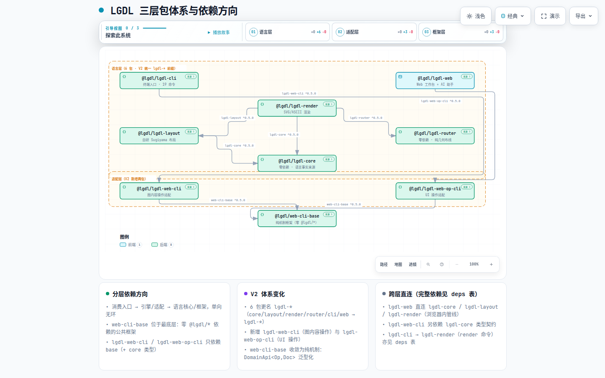

# 系统架构 — 全景入口

> **文档定位**: sddu-docs-overview — 本级全景入口
> **输出文件名**: docs-overview.md
> **数据来源**: 代码扫描生成（用户指令触发）；素材为 packages/*/package.json、tsconfig.json、根配置、.github/workflows、scripts/
> **创建时间**: 2026-08-30
> **版本**: v2.0（feature/group-as-node @ d03dca4，V2 9 包体系）
> **生成方式**: 全量构建 + V2 增量更新

---

## 1. 业务全景

### 1.1 自身概述

| 属性 | 值 |
|------|-----|
| **类型** | npm workspaces monorepo（9 包，TypeScript ESM） |
| **职责描述** | 把「语义优先」的 `.lgdl` 文本编译为自动布局的 SVG/PNG/ASCII 图；为终端用户与 AI Agent 分别提供 CLI 与 Web 两个入口；AI 操作经适配层（lgdl-web-cli / lgdl-web-op-cli）接入纯机制框架（web-cli-base） |
| **所属业务域** | LGDL 项目根 |
| **版本** | 根 package.json 0.5.0（各子包均 0.5.0；lgdl-web 为 private 不发布） |

### 1.2 子组件

| 组件 | 类型 | 描述 | 关系说明 |
|------|------|------|---------|
| **lgdl-core** | 库包 | 语言核心：解析器（手写 YAML 子集）、语义模型（group-as-node）、严格校验、增量变更协议、格式转换注册表。零依赖（V2 由 core 更名，零语义改动） | 被其余语言/适配包依赖——唯一的「语言事实来源」 |
| **lgdl-layout** | 库包 | 确定性布局引擎：自研 Sugiyama 分层（`layered.ts`）+ 分组感知两层布局 + 5 种专用布局。仅依赖 lgdl-core | 依赖 lgdl-core；被 lgdl-render 与 lgdl-web 直接依赖 |
| **lgdl-router** | 库包 | 正交边布线引擎：A* 网格搜索 + 形状边界锚定，纯几何、零依赖、不知 DOM 与样式。⚠️ README 此前未提及（V2 全景已补） | 零包间依赖；被 lgdl-render 依赖（从 render 抽出，commit `203a000`） |
| **lgdl-render** | 库包 | SVG/ASCII 渲染器：形状映射、锚点系统、标签避让、`data-lgdl-loc` 源映射。依赖 lgdl-core + lgdl-layout + lgdl-router | 流水线末端；同时被 lgdl-cli 与 lgdl-web 消费 |
| **lgdl-cli** | 应用包 | 终端 `lgdl-cli`：16 个命令（init/render/status/queries/convert/import/6 个增量编辑），commander + `--file` 磁盘 IO。依赖 lgdl-web-cli + lgdl-core + lgdl-render + commander | 发布到 npm 的门面包（V2 由 cli 更名，bin 不变） |
| **lgdl-web** | 应用包（private） | Web 工作台：React 18 + Vite + CodeMirror 6，内嵌与终端同管线的编译循环 + AI 助手（原生 function calling 三工具）。依赖适配层 ×2 + web-cli-base + 引擎 ×3 | 部署到 GitHub Pages 的 SPA（V2 由 web 更名） |
| **lgdl-web-cli** | 库包（V2 新增） | 图内容操作适配：COMMANDS 6 命令注册表、LgdlOperation 协议、WEB_CLI_TOOL、lgdl-web-cli 协议解析、help 自文档、lgdlDomain/lgdlExecutor 组装单点 | 依赖 web-cli-base（机制）+ lgdl-core（类型）；被 lgdl-cli 与 lgdl-web 消费 |
| **lgdl-web-op-cli** | 库包（V2 新增） | UI 操作适配：OP_COMMANDS 单一数据源（16 条）→ WEB_OP_TOOL 动态生成、webOpHelp、next-actions、OpHandlerRegistry 注入面。零 React/DOM | 依赖 web-cli-base（仅类型）；被 lgdl-web 消费 |
| **web-cli-base** | 库包 | **纯机制框架**：DomainApi<Op,Doc> 泛型契约、createExecutor 管线、createOperationApplier 泛型工厂、协议解析骨架、LLM 工具封装、web-fetch 通用工具。**零 @lgdl/* 依赖**（deps 仅 openai/anthropic SDK） | 被 lgdl-web-cli / lgdl-web-op-cli / lgdl-web 依赖（V2 纯化） |

### 1.3 子组件分类

| 分类 | 包含组件 |
|------|---------|
| **框架层（纯机制、零 lgdl 依赖）** | web-cli-base |
| **适配层（V2 新增，桥接业务与框架）** | lgdl-web-cli（图内容）、lgdl-web-op-cli（UI 操作） |
| **语言与语义层** | lgdl-core |
| **几何计算层（纯函数、零 DOM）** | lgdl-layout、lgdl-router |
| **呈现层** | lgdl-render |
| **消费入口层** | lgdl-cli（终端）、lgdl-web（浏览器） |

---

## 2. 技术全景

### 2.1 分层与依赖方向

> **[打开交互图：LGDL 三层包体系与依赖方向](../diagrams/architecture-layers.html)**
> 自包含 HTML（Archify 编译，IR 源文件 `diagrams/ir/architecture-layers.json`），支持亮/暗主题切换、平移缩放、聚焦与上下游依赖追踪。

依赖规则（实测自各 package.json `dependencies`）：

| 依赖方 | 被依赖方 | 版本约束 | 证据 |
|--------|---------|---------|------|
| lgdl-layout | lgdl-core | ^0.5.0 | packages/lgdl-layout/package.json |
| lgdl-render | lgdl-core + lgdl-layout + lgdl-router | ^0.5.0 ×3 | packages/lgdl-render/package.json |
| lgdl-cli | lgdl-web-cli + lgdl-core + lgdl-render + commander | ^0.5.0 ×3 / ^12.0.0 | packages/lgdl-cli/package.json |
| lgdl-web | lgdl-web-cli + lgdl-web-op-cli + web-cli-base + lgdl-core + lgdl-layout + lgdl-render + 13 个前端运行时依赖 | ^0.5.0 ×6 | packages/lgdl-web/package.json |
| lgdl-web-cli | web-cli-base + lgdl-core | ^0.5.0 ×2 | packages/lgdl-web-cli/package.json（V2 新包） |
| lgdl-web-op-cli | web-cli-base（仅类型） | ^0.5.0 | packages/lgdl-web-op-cli/package.json（V2 新包） |
| lgdl-router | （无） | — | packages/lgdl-router/package.json `"dependencies": {}` |
| lgdl-core | （无） | — | package.json 描述「zero dependencies」 |
| web-cli-base | openai + @anthropic-ai/sdk（**零 @lgdl/\***） | ^7.5.0 / ^0.120.0 | packages/web-cli-base/package.json（V2 纯化） |

构建体系：根 `tsconfig.json` 用 project references 串起 lgdl-core → lgdl-layout → lgdl-router → lgdl-render → lgdl-cli（**lgdl-web 不在其中**——它是 Vite 应用，`moduleResolution: Bundler`，`noEmit`，由 `vite build` 单独打包；`predev` 钩子会先构建依赖包；lgdl-web-cli / lgdl-web-op-cli / web-cli-base 各自独立 `tsc` 构建，由 lgdl-web 的 predev 显式引用）。

### 2.2 router 包职责澄清（README 缺口补充）

README 架构树（commit d03dca4 前的版本）只列 5-6 包。从代码澄清的 router 定位（V2 全景更新后 README 已含 9 包树）：

- **是什么**：`@lgdl/lgdl-router` —— 正交边布线引擎。输入「布局折线 + 两端节点盒/形状 kind + 障碍盒集合」，输出「90° 正交、绕开所有第三方盒子的最终折线」（packages/lgdl-router/src/index.ts:1-10 模块头注释）。
- **从哪来**：commit `203a000`「refactor(render): 把走线抽到独立的 @lgdl/router 包」——从 render 内部抽出成独立包（main 分支无此包）。
- **为什么独立**：纯几何、零依赖、可独立测试（8 条回归测试）；render 只负责「画」，路由只负责「走线怎么绕」。
- **关键导出**：`routeEdge`（A* 主入口）、`shapeEdgePoint`/`roundedRectPoint`（形状方程求交锚点）、`orthogonalize`（降级正交化）、`routeRectilinear`（候选通道法）、`pathClearanceInterior`/`pathHugLength`/`countCrossingsWithRouted`（质量度量）。

### 2.3 架构决策记录（ADR）

| 编号 | 标题 | 状态 | 影响范围 |
|:--:|------|:--:|---------|
| ADR-001 | 布局引擎三阶段演进：dagre → elkjs → 彻底自研 | ACCEPTED | lgdl-layout、lgdl-web 打包 |
| ADR-002 | 语义模型统一：group-as-node | ACCEPTED（开发分支） | lgdl-core、lgdl-layout、lgdl-render 及全部下游 |
| ADR-003 | 布线抽出独立 router 包 | ACCEPTED | lgdl-render、lgdl-router |
| ADR-004 | 双 CLI 物理分离 + core 命令注册表单一实现 | ACCEPTED | lgdl-cli、lgdl-web、lgdl-core |
| ADR-005 | error-only 严格校验（无静默降级） | ACCEPTED | lgdl-core parser |
| ADR-006 | AI 不直接写源码，只走增量命令 | ACCEPTED | lgdl-web AI、lgdl-cli |
| ADR-007 | markdown 协议块升级为原生 function calling | ACCEPTED | lgdl-web AI |
| ADR-008 | 增量编辑协议（AI 永不整图重写） | ACCEPTED | lgdl-core、lgdl-cli、lgdl-web |
| **ADR-V2-001** | 6 包重命名执行策略（git mv + 身份先行 + 引用后改 + lock 重建） | **ACCEPTED（V2 已实施）** | 全仓（commit d03dca4） |
| **ADR-V2-002** | 依赖方向：base 零 lgdl 依赖；lgdl-web-cli → base + lgdl-core 单向无环 | **ACCEPTED（V2 已实施）** | web-cli-base / lgdl-web-cli / lgdl-web-op-cli |
| **ADR-V2-003** | DomainApi<Op,Doc> 泛型化契约：结构化类型兼容，lgdl-core 类型零改动 | **ACCEPTED（V2 已实施）** | web-cli-base 契约面 |
| **ADR-V2-004** | createOperationApplier 泛型化回留 base：dispatch 映射注入 | **ACCEPTED（V2 已实施）** | web-cli-base / lgdl-web-cli |
| **ADR-V2-005** | exec 管线参数化注入面（commandPrefix/parseBatch/describeSubcommand） | **ACCEPTED（V2 已实施）** | web-cli-base exec 管线 |
| **ADR-V2-006** | op-cli handler 注入面：OpHandlerRegistry 注册表 | **ACCEPTED（V2 已实施）** | lgdl-web-op-cli / lgdl-web |
| **ADR-V2-007** | web-fetch 中性化归位：lgdl-web-fetch → web-fetch | **ACCEPTED（V2 已实施）** | web-cli-base / lgdl-web |
| **ADR-V2-008** | op 协议单一数据源：OP_COMMANDS 注册表 → WEB_OP_TOOL 动态生成 | **ACCEPTED（V2 已实施）** | lgdl-web-op-cli |
| **ADR-V2-009** | 回归门禁口径：守恒 388 + 断言逐字节 + 新增接线测试 | **ACCEPTED（V2 已实施）** | 全仓测试 |

> 详见根级 [adr-index.md](../adr-index.md)（V1 8 条 + V2 9 条含决策/备选/理由/证据锚点）。

### 2.4 部署拓扑

| 通道 | 机制 | 触发 | 证据 |
|------|------|------|------|
| **npm 包** | `@lgdl/lgdl-cli`（bin: lgdl-cli），files 仅 dist | 手动发布（v0.5.0 已上 npm，V2 更名 @lgdl/cli → @lgdl/lgdl-cli） | packages/lgdl-cli/package.json |
| **GitHub Pages** | deploy-pages.yml：checkout → node 20 → `npm ci` → 构建 lgdl-core/lgdl-layout/lgdl-render/web-cli-base/lgdl-web-cli/lgdl-web-op-cli → `GH_PAGES=true vite build` lgdl-web → upload-pages-artifact | push 到 main 且路径命中 packages/{lgdl-web,lgdl-core,lgdl-layout,lgdl-render,lgdl-web-cli,lgdl-web-op-cli,web-cli-base}/** | .github/workflows/deploy-pages.yml |

> ⚠️ G1 缺口（沿革）：workflow 的 build 步骤**仍不含 packages/lgdl-router 与 packages/lgdl-cli**（V2 已补 lgdl-web-cli/lgdl-web-op-cli/web-cli-base）。CI 裸机上 lgdl-render 构建依赖 lgdl-router 的 dist 产物（NodeNext 解析 node_modules/@lgdl/lgdl-router），缺 router 将构建失败。仅记录，未修改。

## 修订记录

| 生成时间 | 变更 Feature | 生成方式 | 修订人 |
|---------|-------------|:--:|--------|
| 2026-08-30 | 代码级扫描全量生成 | 全量构建 | sddu-docs Agent |
| 2026-09-01 | V2 增量更新：6 包 → 9 包（lgdl-* 更名 + 适配层 ×2 + web-cli-base 纯化），子组件表/依赖表/分层图/部署拓扑全面刷新 | 增量更新 | sddu-docs Agent |
