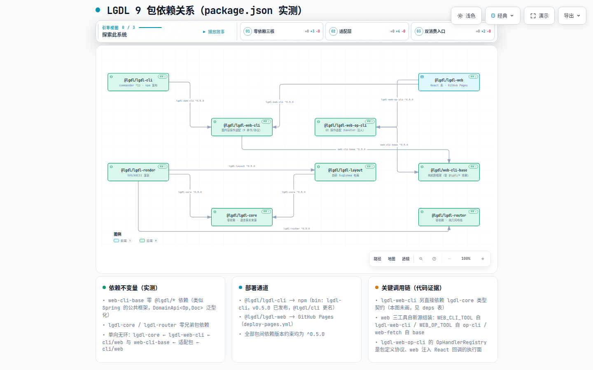

# 系统架构 — 包依赖关系

> **文档定位**: sddu-docs-relation-deps — 描述本级组件之间的调用依赖关系，含调用方、被调用方、调用类型和依赖方向
> **输出文件名**: 包依赖关系-deps.md
> **数据来源**: 代码扫描生成（packages/*/package.json + import 语句 grep 实测）
> **创建人**: sddu-docs Agent
> **创建时间**: 2026-08-30
> **版本**: v2.0（V2 9 包体系更新，HEAD d03dca4）
> **更新说明**: 6 包 → 9 包全量刷新（重命名 lgdl-* + 新增 lgdl-web-cli / lgdl-web-op-cli + web-cli-base 纯化零 lgdl 依赖）

---

## 1. 依赖关系总览

| 调用方 | 被调用方 | 调用类型 | 依赖方向 | 说明 |
|--------|---------|---------|:--:|------|
| **@lgdl/lgdl-layout** | @lgdl/lgdl-core | 编译期 + 运行时 | 单向 | 引 `VIS_SYMBOL`、`deriveGroups`、类型（packages/lgdl-layout/src/index.ts:16） |
| **@lgdl/lgdl-router** | （无） | — | — | 纯几何零依赖（package.json `"dependencies": {}`） |
| **@lgdl/lgdl-render** | @lgdl/lgdl-core | 编译期 + 运行时 | 单向 | 类型 + `VIS_SYMBOL` + `deriveGroups`（render/index.ts:7-8） |
| **@lgdl/lgdl-render** | @lgdl/lgdl-layout | 编译期 + 运行时 | 单向 | 引 `LayoutResult` 契约类型（render/index.ts:9） |
| **@lgdl/lgdl-render** | @lgdl/lgdl-router | 编译期 + 运行时 | 单向 | 引 `routeEdge`/`shapeEdgePoint`/`routeRectilinear`（render/index.ts:10）——**v0.6 新增，main 上不存在** |
| **@lgdl/lgdl-cli** | @lgdl/lgdl-web-cli | 编译期 + 运行时 | 单向 | 9 个 mutation 命令（add/remove/update × node/edge/group）import `applyOperation`/`buildOperation`（V2 切换，commit d03dca4） |
| **@lgdl/lgdl-cli** | @lgdl/lgdl-core | 编译期 + 运行时 | 单向 | 解析/变更/查询/status/转换/模板 走 lgdl-core 单一实现 |
| **@lgdl/lgdl-cli** | @lgdl/lgdl-render | 编译期 + 运行时 | 单向 | render 命令调 `layoutDocument` + `renderSvg`/`renderAscii` |
| **@lgdl/lgdl-cli** | commander ^12 | 运行时 | 单向 | 唯一第三方运行时依赖（cli.ts:9） |
| **@lgdl/lgdl-web** | @lgdl/lgdl-web-cli | 运行时（Vite 打包） | 单向 | AiPanel 经 `@lgdl/lgdl-web-cli/lgdl` 消费 executeSubcommand（AiPanel.tsx:5） |
| **@lgdl/lgdl-web** | @lgdl/lgdl-web-op-cli | 运行时（Vite 打包） | 单向 | WEB_OP_TOOL + OpHandlerRegistry（App.tsx opRegistry 注入） |
| **@lgdl/lgdl-web** | @lgdl/web-cli-base | 运行时（Vite 打包） | 单向 | createExecutor/LineHandleResult + web-fetch 工具（provider.ts:17） |
| **@lgdl/lgdl-web** | @lgdl/lgdl-core + lgdl-layout + lgdl-render | 运行时（Vite 打包） | 单向 | App.tsx:11-13 编译管线三件套；ai/ 引 core 查询与变更 |
| **@lgdl/lgdl-web** | react / react-dom 18.3 | 运行时 | 单向 | UI 框架 |
| **@lgdl/lgdl-web** | codemirror 6 系（codeMirror/lang-yaml/autocomplete/lint） | 运行时 | 单向 | 编辑器：高亮/补全/红波浪线诊断 |
| **@lgdl/lgdl-web** | openai ^7.5 / @anthropic-ai/sdk ^0.120 | 运行时 | 单向 | 多厂商 AI 接入（OpenAI 兼容端点走 openai SDK；Claude 走 anthropic） |
| **@lgdl/lgdl-web** | react-markdown + remark-gfm | 运行时 | 单向 | AI 回复 markdown 渲染 |
| **@lgdl/lgdl-web-cli** | @lgdl/web-cli-base | 编译期 + 运行时 | 单向 | 泛型机制（createExecutor/createOperationApplier/tokenizeCli/parseArgs/HelpArg/HelpEntry）（V2 新包） |
| **@lgdl/lgdl-web-cli** | @lgdl/lgdl-core | 编译期（类型） + 运行时 | 单向 | LgdlOperation/LgdlDocument 类型契约 + 领域函数（lgdlDomain 组装）（V2 新包） |
| **@lgdl/lgdl-web-op-cli** | @lgdl/web-cli-base | 编译期（仅类型） | 单向 | 仅 HelpArg/HelpEntry 类型；零 React/DOM（V2 新包，NFR-004） |
| **@lgdl/web-cli-base** | openai ^7.5 + @anthropic-ai/sdk ^0.120 | 运行时 | 单向 | **零 @lgdl/\* 依赖**（V2 纯化，FR-018）；LLM 工具封装 + web-fetch 通用工具 |
| **scripts/gen-examples.mjs** | lgdl-core/lgdl-layout/lgdl-render（dist 产物） | 脚本期 | 单向 | 从 web/src/examples.ts 单一来源生成 examples/ 三件套 |

**反向约束（谁依赖谁的不变量）**：
- web-cli-base 不依赖任何 @lgdl/* 包（纯机制框架，机制契约全部泛型化——V2 核心不变量）；
- lgdl-core / lgdl-router 不依赖任何兄弟包（语言事实下沉 / 纯几何可独立复用）；
- lgdl-layout 不依赖 lgdl-router / lgdl-render（布局与走线解耦——布局输出中心到中心的粗折线，走线是 render 编排 router 完成的后续阶段）；
- lgdl-web-cli / lgdl-web-op-cli 不依赖 lgdl-cli / lgdl-web（适配层不反向依赖消费方）。

## 2. 依赖图概述

> **[打开交互图：LGDL 9 包依赖关系](../diagrams/architecture-deps.html)**
> 自包含 HTML（Archify 编译，IR 源文件 `diagrams/ir/architecture-deps.json`），支持亮/暗主题切换、平移缩放、聚焦与上下游依赖追踪。

关键调用链（代码证据）：

1. **渲染主链**：`render/index.ts:10` 从 router 引入 `routeEdge`——每条边的最终折线由 router 的 A* 网格搜索决定，render 只把折线画出来。这条 import 是 v0.6「布线抽出」重构的落点（commit `203a000`）。
2. **cli 的适配层入口**：9 个 mutation 命令 import `@lgdl/lgdl-web-cli`（V2 切换，commit d03dca4）——增量命令业务逻辑（COMMANDS 注册表）在 lgdl-web-cli，lgdl-cli 只做 argv 适配。
3. **web 的三工具分发**：lgdl-web-cli（图内容）/ lgdl-web-op-cli（UI 操作）/ web-cli-base（web-fetch）三源组装（provider.ts:17-20），OpHandlerRegistry 由 App.tsx 注入 16 个 React 回调。
4. **测试隔离**：lgdl-router 有独立 8 条回归测试（router.test.ts），可在不启动 render 的情况下验证绕障行为；lgdl-web-cli 76 例随迁测试（V2 守恒验证）。
5. **框架层复用面**：web-cli-base 的 DomainApi<Op,Doc> 泛型契约使任意领域可实例化（V2 ADR-V2-003）——web-fetch 工具同时被 lgdl-web（浏览器 fetch）与 lgdl-web-cli（exec 管线 handleLine 注入）消费。

## 修订记录

| 版本 | 变更说明 | 日期 | 修订人 |
|------|---------|------|--------|
| v1.0 | 初始创建 | 2026-08-30 | sddu-docs Agent |
| v2.0 | V2 9 包体系：6 包更名 lgdl-*、新增 lgdl-web-cli/lgdl-web-op-cli 依赖边、web-cli-base 零 lgdl 依赖、cli 9 命令切换依赖源 | 2026-09-01 | sddu-docs Agent |
