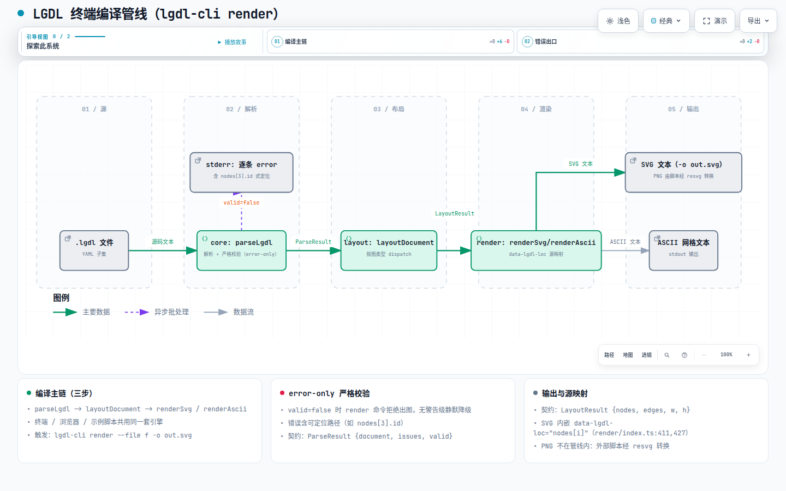
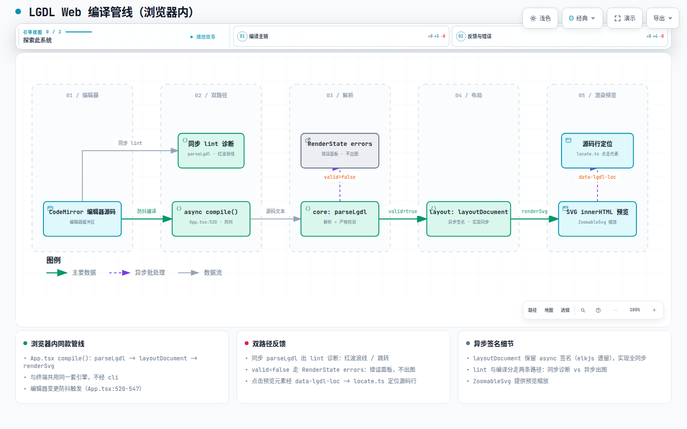
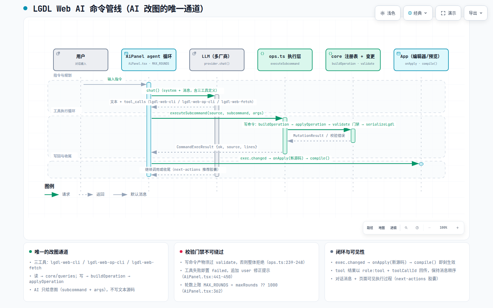

# 系统架构 — 端到端数据流

> **文档定位**: sddu-docs-relation-flow — 描述本级组件之间的数据流向，含数据源、数据目标、数据格式和转换规则
> **输出文件名**: 端到端数据流-dataflow.md
> **数据来源**: 代码扫描生成（cli/commands/render.ts、web/App.tsx compile、web/ai/ops.ts + AiPanel、scripts/gen-examples.mjs 实读）
> **创建人**: sddu-docs Agent
> **创建时间**: 2026-08-30
> **版本**: v1.0
> **更新说明**: 初始创建

---

## 1. 数据流总览

LGDL 有三条端到端管线，全部汇聚到同一套 core → layout → render 引擎：

| 数据源 | 数据目标 | 数据格式 | 转换规则 | 触发条件 |
|--------|---------|---------|---------|---------|
| `.lgdl` 磁盘文件 | SVG / ASCII 文本 | YAML 子集文本 | `parseLgdl` → `layoutDocument` → `renderSvg`/`renderAscii`（PNG 经 resvg 由外部脚本转换） | `lgdl-cli render --file f -o out.svg` |
| 编辑器缓冲区源码 | 预览 SVG（浏览器内存） | 同上 | `App.tsx compile()`：同一三步管线（异步）；lint 另走同步 `parseLgdl` 拿 issue 位置 | 每次编辑器变更（防抖） |
| LLM 工具调用 | 编辑器新源码 | `{subcommand, args}` JSON | `executeSubcommand` → `buildOperation`（core 注册表）→ `applyOperation`（core 变更）→ `validate` 门禁 → `serializeLgdl` → `onApply` 写回编辑器 → compile | AI 助手 agent 循环每轮 |
| packages/web/src/examples.ts | examples/*.lgdl + .svg + .png | TS 内嵌字符串 | gen-examples.mjs 用正则提取 EXAMPLES → parse → layout → renderSvg（PNG 需 @resvg/resvg-js） | `node scripts/gen-examples.mjs`（手动） |

### 1.1 终端管线（lgdl-cli render）

> **[打开交互图：终端编译管线](../diagrams/dataflow-cli.html)**
> 自包含 HTML（Archify 编译，IR 源文件 `diagrams/ir/dataflow-cli.json`），支持亮/暗主题切换、平移缩放、聚焦与路径追踪。

要点：
- `valid=false` 时 render 命令拒绝出图——错误以「error + 可定位路径」呈现，无警告级静默降级（core parser）。
- SVG 内嵌 `data-lgdl-loc="nodes[i]"` 源映射属性，静态输出不受影响，Web 预览用它做点击定位（render/index.ts:411,427 等处）。

### 1.2 Web 编译管线（浏览器内）

> **[打开交互图：Web 编译管线](../diagrams/dataflow-web.html)**
> 自包含 HTML（Archify 编译，IR 源文件 `diagrams/ir/dataflow-web.json`），支持亮/暗主题切换、平移缩放、聚焦与路径追踪。

### 1.3 Web AI 命令管线（AI 改图的唯一通道）

> **[打开交互图：Web AI 命令管线](../diagrams/sequence-ai-ops.html)**
> 自包含 HTML（Archify 编译，IR 源文件 `diagrams/ir/sequence-ai-ops.json`），支持亮/暗主题切换、平移缩放、聚焦与路径追踪。

要点：
- **失败反馈修正**：任一工具调用失败即置 `failed`，所有 tool 结果回传后追加一条 user 角色「上一条命令执行失败…请修正」（AiPanel.tsx:441-446）。
- **轮数上限**：`MAX_ROUNDS = settings.maxRounds ?? 1000`（AiPanel.tsx:362；provider.ts:89），到顶自动停止并提示。
- **AI 无法绕过校验**：写命令的产物必须重新通过 `validate`，否则整体拒绝（ops.ts:239-248）——「AI 不直接写源码」的技术兜底。

## 2. 数据流概述

三条管线共享同一个不变式：**源码是唯一事实，布局/走线/渲染都是源码的纯函数投影**。

- 同一份 `.lgdl` 在终端、浏览器、示例脚本里走的是同一套 core 解析、同一套布局 dispatch、同一套渲染映射——这是「双 CLI 分离、业务逻辑单一实现」决策的数据流体现。
- 增量命令的数据流闭环（AI 通道）刻意设计成：**工具调用 → 结构化 Operation → 变更 → 校验 → 序列化回源码 → 再编译**。源码永远由序列化器写出，LLM 只产生意图（subcommand + args），从不产生文本化的最终源码。
- 数据流中的两个「降级口」：布局层对 >120 节点的 flowchart/state/er 自动降级 O(n) 网格布局（layout/index.ts:85,124-129）；布线层在 A* 找不到通路时降级 `orthogonalize` 启发式（router/index.ts:219-220）。

## 修订记录

| 版本 | 变更说明 | 日期 | 修订人 |
|------|---------|------|--------|
| v1.0 | 初始创建 | 2026-08-30 | sddu-docs Agent |
