# LGDL — Logical Graph Description Language

> 逻辑化的图描述语言 · Semantic-first diagram language for AI agents

**LGDL（Logical Graph Description Language）是一门面向 AI Agent 的语义优先图表描述语言。** 它只描述图的「逻辑」（节点、关系、层级），从不描述「布局」（坐标、样式）。布局由确定性引擎自动完成，AI 修改图时只改逻辑，不碰布局——彻底告别「AI 来回调整图形布局」的低效循环。

**LGDL is a semantic-first diagram description language built for AI agents.** It describes only the *logic* of a diagram (nodes, relations, hierarchy) — never the *layout* (coordinates, styles). Layout is handled automatically by a deterministic engine, so AI edits change only the logic, never the layout.

> **v0.5.0（2026-08-23）已定型** · 语义模型、9 种图渲染、Web 工作台、**AI 助手（命令模式）**、CLI 全部稳定

---

## 🖼️ 效果展示 / Gallery

> 🚀 **在线体验 Web 工作台**：[LGDL Workbench](https://thzsummer.github.io/LGDL/) —— 浏览器里编辑源码、实时渲染、点击定位源码、导出 SVG/PNG

一种 LGDL 语言，九种图——全部由 `lgdl render` 自动布局生成，无任何手工排版：

| flowchart 流程图 | flowchart 实战 | mindmap 思维导图 |
|---|---|---|
| <p align="center">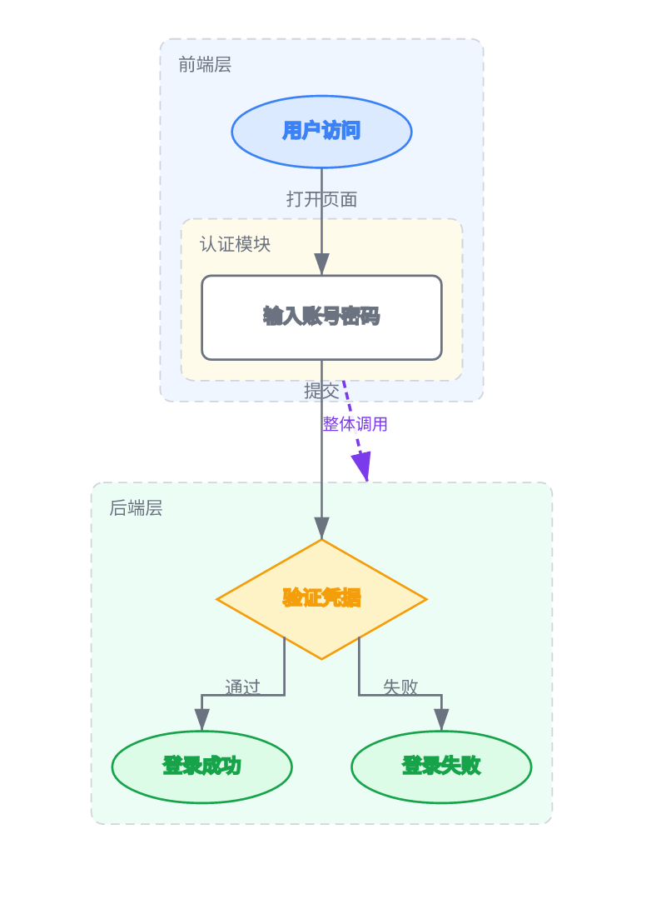<br/>[📄 源码](examples/login-flow.lgdl)</p> | <p align="center">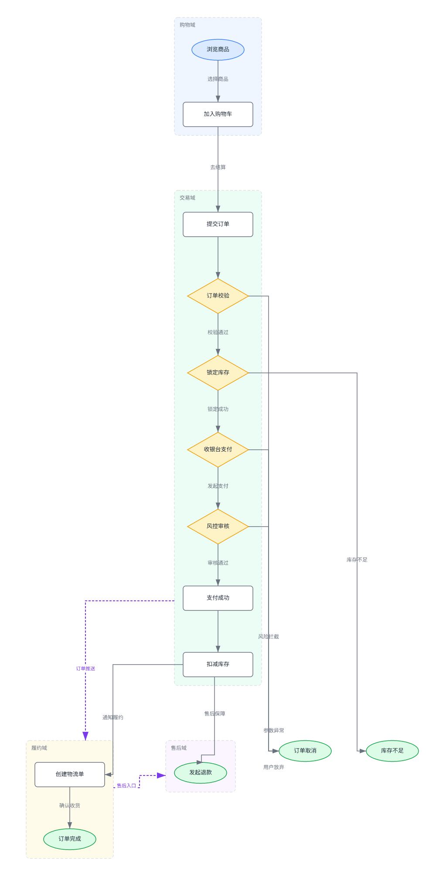<br/>[📄 源码](examples/ecommerce-flow.lgdl)</p> | <p align="center">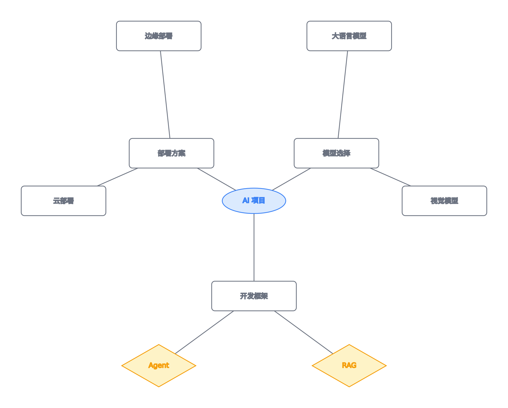<br/>[📄 源码](examples/mindmap.lgdl)</p> |

| sequence 时序图 | uml-class 类图 | arch 架构图 |
|---|---|---|
| <p align="center">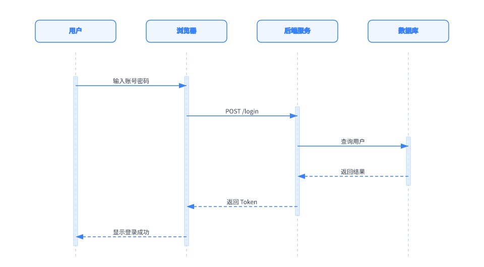<br/>[📄 源码](examples/sequence.lgdl)</p> | <p align="center">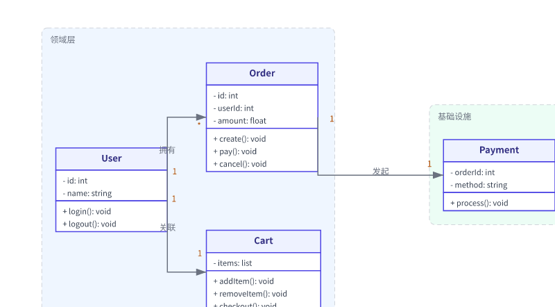<br/>[📄 源码](examples/uml-class.lgdl)</p> | <p align="center">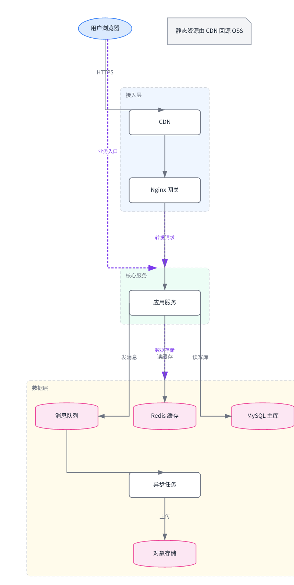<br/>[📄 源码](examples/architecture.lgdl)</p> |

| arch 实战：微服务 | datastream 数据流 | er ER 图 |
|---|---|---|
| <p align="center">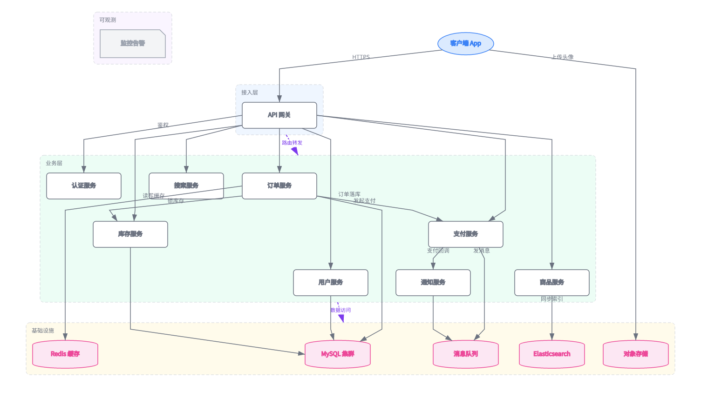<br/>[📄 源码](examples/microservices.lgdl)</p> | <p align="center">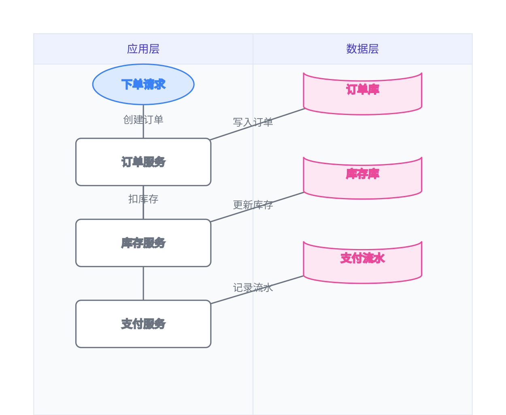<br/>[📄 源码](examples/datastream.lgdl)</p> | <p align="center">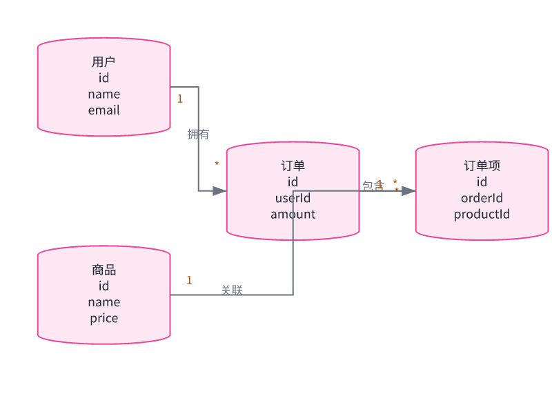<br/>[📄 源码](examples/er.lgdl)</p> |

| state 状态机 | gantt 甘特图 | |
|---|---|---|
| <p align="center">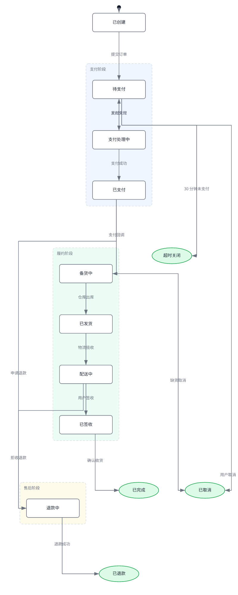<br/>[📄 源码](examples/state.lgdl)</p> | <p align="center">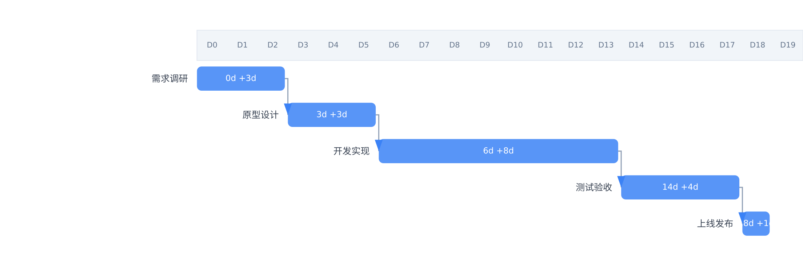<br/>[📄 源码](examples/gantt.lgdl)</p> | |

---

## 🚀 快速开始 / Quick Start

> 📦 已发布到 npm：`npm install -g @lgdl/cli`

```bash
npm install -g @lgdl/cli              # 安装 CLI

lgdl init --file my-diagram.lgdl      # 初始化空图
lgdl render --file my-diagram.lgdl -o out.svg   # 渲染（自动布局）
lgdl status --file my-diagram.lgdl    # 输出文本化图结构 ← AI 读取当前图
```

---

## ✨ v0.4.0 核心特性

### 1. 语义模型：显性字段，零猜测

LGDL 的每个概念都有**显性字段**，渲染器从不从文本里猜含义——所有旧写法一律被校验拒绝（`error`），不留兼容包袱：

| 特性 | 字段 | 说明 |
|---|---|---|
| 类成员（uml-class / er） | `members` | 结构化对象数组 `{kind, name, visibility, type, params}`，替代 `label` 里 `\n` 拼接的隐式约定 |
| 关联多重性（er / uml-class） | `cardinalityFrom` / `cardinalityTo` | 两端多重性独立显性表达，`label` 只放关系名 |
| 聚合边（组间关系） | `from` / `to` 引用 **group id** | group→group、group→node、node→group，紫色虚线箭头 |
| 分组与嵌套 | `groups[].contains` | 支持嵌套分组、泳道 |

### 2. 严格校验

解析器对每个问题都报 `error`（无警告级静默降级）：未知 kind、未知引用、重复 id、一元素属两组、分组环、缩进错误、旧写法（label 内 `\n` 成员、label 里混基数、`attrs.cardinality`）全部拒绝并给出可定位的报错（`nodes[3].id` 等路径）。

### 3. 渲染：锚点系统

- 边端点吸附到节点**真实形状边界**（菱形、圆柱、椭圆、便签五边形、圆角矩形按各自方程求交），方向按 15° 量化（24 锚点）
- 预览中**悬停节点/边/分组**显示其锚点圆点；**左键点击任意元素**自动定位到对应源码行
- 文字宽度自适应（CJK 感知），实体卡片按 `members` 行数自适应尺寸

### 4. Web 工作台

- 在线编辑 + 实时渲染 + 语法高亮 + IntelliSense 补全 + 错误诊断（红波浪线/跳转）
- 示例**滑动指针**切换：一步切换、滑动吸附选中
- 滚轮缩放（FitView 起，最小 50%）+ 边缘平移，导出 SVG / PNG
- 支持 Mermaid / PlantUML / JSON 转换导入导出

### 5. Web AI 助手（v0.5）

- **命令模式（web-cli）**：AI 像在 Linux 终端里一样用 `lgdl` 命令操作图（`lgdl status` / `lgdl add-node --id x --label y` …），**不直接写 LGDL 源码**——源码只由命令执行产生；命令与 CLI 完全同一套语义（`core/cli-parser.ts`），点「执行」逐条应用、失败即停
- **多厂商接入**：DeepSeek / Qwen / 腾讯混元 / OpenAI / Claude 浏览器直连可用；火山方舟（通用 / Coding / Agent Plan）CORS 受限，需本地代理（v0.6）
- 设置面板两步配置：选服务商 + 填 API Key（各服务商 key 独立保存）；「测试连接」一键验证 key / 端点 / CORS
- 预置快捷操作（语法修复 / 自动优化 / 九种图类型创作等）+ 自动应用开关

---

## 📝 LGDL 语法速览 / Syntax

```yaml
title: 订单系统
type: uml-class          # flowchart | mindmap | uml-class | arch | datastream | er | state | gantt | sequence

nodes:
  - id: user
    label: 用户
    kind: entity
    members:             # 结构化类成员（仅 uml-class / er 的 entity）
      - kind: attribute
        name: name
        type: string
        visibility: private
      - kind: method
        name: login
        type: void
        params: "(pwd: string)"
        visibility: public

edges:
  - from: user
    to: order
    label: 拥有            # 关系名只放 label
    cardinalityFrom: "1"   # 多重性走显性字段
    cardinalityTo: "*"
  - from: front            # 聚合边：引用 group id
    to: core
    label: 转发请求

groups:
  - id: front
    label: 接入层
    contains: [nginx, gateway]
  - id: core
    label: 核心服务
    contains: [user, order, auth]
```

`flowchart` 完整示例见 [examples/](examples/)，节点 `kind` 取值：`start | end | process | decision | entity | note | state | milestone`。

---

## 🛠️ CLI 命令 / CLI Reference

| 命令 | 作用 |
|---|---|
| `lgdl init --file <f>` | 初始化空图 |
| `lgdl render --file <f> -o out.svg` | 渲染 SVG（自动布局） |
| `lgdl status --file <f>` | 输出文本化图结构（AI 可读） |
| `lgdl add-node / update-node / remove-node` | 增量编辑节点（`--member` / `--member-add` / `--member-remove` 管理类成员） |
| `lgdl add-edge / update-edge / remove-edge` | 增量编辑边（`--cardinality-from` / `--cardinality-to` 设多重性） |
| `lgdl add-group / remove-group` | 增量编辑分组 |
| `lgdl convert --file <f> --as mermaid\|plantuml\|json [-o out]` | 导出为其他格式 |
| `lgdl import --file <f> --from mermaid --output out.lgdl` | 从 Mermaid 导入为 LGDL |

增量编辑协议：AI 的每次修改都是**增量 patch**，只重算受影响区域，已有节点位置保持稳定——AI 永远不会重写整个文件。

---

## 🏗️ 架构 / Architecture

```
LGDL/
├── packages/
│   ├── core/          # LGDL 解析、语义模型、校验、格式转换（纯 TS，零依赖）
│   ├── layout/        # 确定性布局引擎（dagre 层级 / 径向树 / 时序 / 泳道 / 甘特）
│   ├── render/        # SVG 渲染器（形状、锚点、ASCII 输出）
│   ├── cli/           # lgdl 命令行（命令注册表 + 增量编辑）
│   └── web/           # Web 工作台（React + CodeMirror 6 + 自研 SVG 预览）
├── docs/              # 设计文档、语言规范、AI 集成指南
├── examples/          # 示例 .lgdl 文件
└── README.md
```

---

## 📚 文档 / Docs

- [LGDL 语言规范](docs/lgdl-spec.md) — LGDL Specification
- [CLI 使用指南](docs/cli-guide.md) — CLI Guide（命令参考、AI Agent 工作流）
- [AI Agent 使用指南](docs/ai-agent-guide.md) — AI Agent Guide（教 AI 用 LGDL 画图）
- [设计文档](docs/design.md) — 设计决策与取舍

---

## 🗺️ 版本历史 / Changelog

| 版本 | 内容 |
|---|---|
| **v0.1** | ✅ 解析器 + 层级布局 + CLI（init/render/status）+ SVG 输出 |
| **v0.2** | ✅ 增量编辑协议 + 9 种图类型渲染 |
| **v0.3** | ✅ attrs 扩展属性 + ER/状态机/甘特图 + Mermaid/PlantUML/JSON 转换 |
| **v0.4** | ✅ 聚合边 + `members` + `cardinalityFrom/To` + 严格校验（去旧写法）+ 锚点系统 + Web 工作台（预览定位/滑动切换/缩放） |
| **v0.5** | ✅ Web AI 助手（命令模式 web-cli、对话生成/修改图、多厂商接入 + 连接测试、共享操作层、自动应用）+ 图即代码规划（语义 diff/评审、CI 自动渲染、`set-type` 命令、增量命令 attrs 删除、status 输出优化、Mermaid 导入增强） |
| **v0.6** | ⏳ 图即代码（语义 diff/评审、CI 自动渲染、`set-type` 命令、增量命令 attrs 删除、status 输出 attrs 与格式优化、Agent 集成提示词模板、Mermaid 导入增强）；模块化：子图引用、参数化模板；渲染与性能（大图优化、布局打磨）；state 显性 `initial` 字段 |

完整变更见 [CHANGELOG.md](CHANGELOG.md)。

---

## 🤝 参与贡献 / Contributing

欢迎提 issue、PR。设计讨论见 [GitHub Discussions](https://github.com/THZSummer/LGDL/discussions)。

## 📄 License

[MIT](LICENSE)
